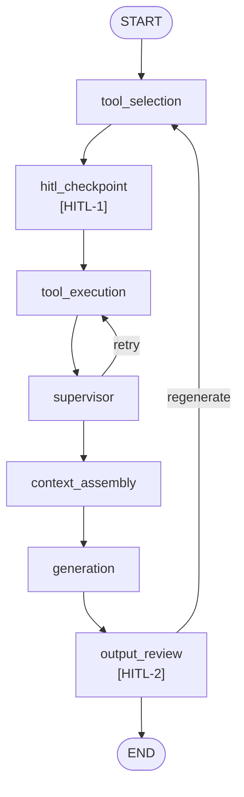
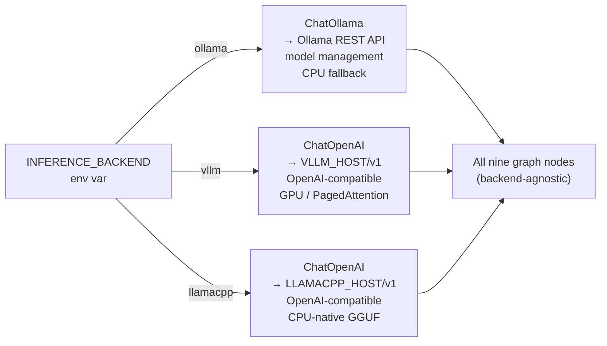
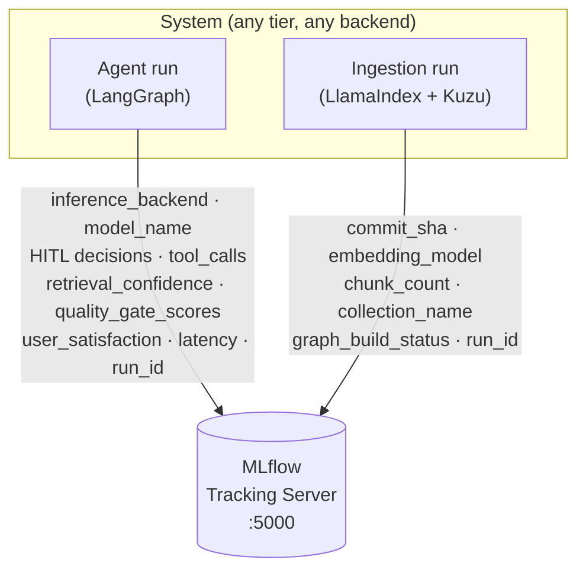
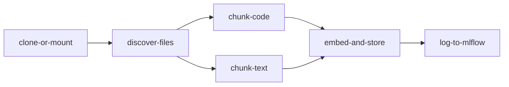

# Architecture & Design Decisions

This document captures the thinking behind the component choices and design patterns in the Code Documentation Assistant. It's written chronologically — decisions are recorded as they were made, not reconstructed after the fact. The aim is to preserve the actual reasoning, including dead ends and trade-offs, rather than presenting a sanitised post-hoc narrative.

A plan was made at the outset, defining the approach in four phases: LLM provider selection, pipeline planning, deployment format, and component selection. Implementation and testing followed as phases 5 and 6. The `dev` branch evolution — agent pipeline, HITL, vLLM integration, MLflow, Argo Workflows — is documented in phases 7 onwards.

---

## Phase 1: LLM Provider — Why Ollama?

**Decision: Ollama with an open-source model.**

The first fork was whether to use a hosted API (OpenAI, Anthropic) or a self-hosted open-source stack. The considerations:

- **Self-contained**: no API keys, no paid accounts required to run or evaluate the system
- **Infrastructure ownership**: standing up the full inference stack demonstrates CI/CD, deployment, provisioning, and ML/AI footprint awareness — not just API consumption
- **Privacy**: for a code documentation tool, keeping code local is often a hard requirement. Many organisations cannot send proprietary source code to external APIs. Self-hosting handles this by default

Trade-off acknowledged: hosted APIs produce noticeably better responses for complex code reasoning, especially architectural questions. For a production system where output quality is paramount and privacy constraints are relaxed, a hybrid approach makes sense — local model for routine queries, API fallback for complex reasoning. The self-hosted path is the right default for this use case.

**Evolution of thinking — from "which API" to "own the stack":**

The initial framing was: which hosted API should be used? The reframing came from recognising that the purpose of this system isn't to show which API produces the best answers, but to engineer the appropriate solution and demonstrate depth across the stack. Wrapping an API is a weekend project; standing up the full inference stack — model serving, embedding pipeline, vector storage, Kubernetes-native deployment — demonstrates infrastructure ownership and full-pipeline awareness. The privacy argument reinforced the decision: for a tool that ingests proprietary codebases, self-hosting isn't a nice-to-have, it's a requirement many organisations would insist on.

---

## Phase 2: README-Driven Development

**Decision: README as a living design document, developed alongside the code.**

Rather than coding first and documenting later, the README was developed in parallel, capturing decision points — especially inflexion points — as they happened.

**Evolution of thinking:**

Writing the README *during* development captures the actual thought process: blind alleys explored, trade-offs weighed, moments where understanding shifted. It also functions as a rubber duck — several technical choices (especially around embedding model selection and vector DB architecture) were refined because writing them down forced sharper thinking.

---

## Phase 3: Deployment — Docker Compose and Helm

**Decision: both, serving different purposes.**

| Aspect | Docker Compose | Helm Chart |
|--------|---------------|------------|
| Purpose | Local dev, single-command startup | Production-grade K8s deployment |
| Audience | Anyone with Docker installed | K8s cluster operators |
| What it shows | Containerisation | Architecture as infrastructure-as-code |

The more interesting reason to have both is what the Helm chart forces you to think about. When you model the system as Kubernetes objects, the architecture becomes explicit:

- **Ollama** → StatefulSet (model weights are persistent state)
- **ChromaDB** → StatefulSet (vector index is persistent state)
- **Application** → Deployment (stateless, horizontally scalable)

The Helm chart also surfaced the composability patterns (the `_helpers.tpl` tier system) that wouldn't have emerged from Docker Compose alone — Compose doesn't have the same templating, system-wide programmability, or automation-ready power.

---

## Phase 4: Component Selection

### 4a. LLM Model Selection — A Tiered Approach

**Decision: tiered model strategy — the system is model-agnostic, model name is a configuration value.**

**Task framing**: this is a *code comprehension + explanation* task, not code generation. The model must read retrieved code chunks, understand what they do, reason about relationships (dependencies, API endpoints, architecture), and explain in natural language. Reasoning capability — following multi-step logic across files — scales with parameter count and is the key differentiator between tiers.

**Models evaluated**:

| Model | Parameters | Strengths | Reasoning | Weaknesses |
|-------|-----------|-----------|-----------|------------|
| Mistral Nemo | 12B | Excellent code comprehension + explanation | Strong multi-step; traces cross-file dependencies | Needs GPU |
| DeepSeek-Coder V2 Lite | 16B (MoE) | MoE excels at polyglot codebases | Strong within-context reasoning | Variable memory patterns |
| Qwen2.5-Coder 7B | 7B | Best code comprehension at 7B tier | Adequate for single-file reasoning | May struggle with complex multi-module chains |
| Phi-3.5 Mini | 3.8B | Runs almost anywhere | Best for straightforward "what does this function do" queries | Not code-specialised |

*CodeLlama 7B was evaluated and excluded — Qwen2.5-Coder 7B supersedes it on modern benchmarks.*

**Tiered defaults**:

1. **Full** — Mistral Nemo (12B). Best balance of explanation quality and code understanding. For polyglot codebases, DeepSeek-Coder V2 Lite is the recommended swap — recent research on MoE architectures confirms they're particularly effective for multi-language tasks, treating programming language diversity analogously to natural language multilingualism ([Wang et al., 2025](https://arxiv.org/abs/2508.19268)).
2. **Balanced** — Qwen2.5-Coder 7B. Best-in-class at 7B. Right choice for ~8GB VRAM.
3. **Lightweight** — Phi-3.5 Mini (3.8B). Edge, CPU-only, or resource-constrained deployments. Fine-tuning candidate.

**Hardware reality check**: frontier models reach trillions of parameters — three orders of magnitude above these. But without a multi-GPU system, models above ~16B aren't practical to serve. These tiers reflect models genuinely usable on realistic hardware.

**Evolution of thinking — from fixed to composable:**

The initial approach was to pick the best model and hard-code it. The shift came from asking: what does configurability actually mean in a Kubernetes-native deployment? Not just swapping a string, but a single high-level intent (`modelTier=lightweight`) that cascades through every dependent decision — which model to pull, memory to request, GPU requirements, context window, timeout. The `_helpers.tpl` implements this. A deployer expresses "I want the lightweight tier" and the system resolves the rest. This is the difference between configuration and *composable system design* — the same principle behind Kubernetes operators and Terraform modules.

### 4b. Embedding Model

**Decision: `nomic-embed-text` as default, with codebase-aware configuration.**

**Critical constraint — embedding compatibility**: you cannot mix embeddings from different models into a single index. Changing the embedding model requires full re-ingestion. The `_helpers.tpl` derives vector dimension from the embedding model choice automatically, preventing silent misconfiguration.

**Codebase-aware embedding selection** — two axes characterise the input:

| Axis | States | Implication |
|------|--------|-------------|
| **Language distribution** | Primary-code (>90% one language) vs. Multi-code | Multi-code benefits from polyglot models; connects to DeepSeek LLM choice |
| **Documentation state** | No-docs / Partial-docs / Review-and-revise | Review-and-revise is most demanding — must handle inconsistencies between code and prose |

**Available models**:

| Model | Dimensions | Best for |
|-------|-----------|----------|
| `nomic-embed-text` | 768 | Partial-documentation codebases (default) |
| `all-minilm` | 384 | Lightweight tier; resource-constrained |
| `mxbai-embed-large` | 1024 | Complex codebases with dense documentation |

**Evolution of thinking — from infrastructure choice to input-driven configuration:**

Initially the embedding model was treated as a pure infrastructure decision. The shift came when recognising that the *nature of the codebase* should inform the choice — and that the embedding model determines much of what's possible downstream. A raw-code-only repo needs strong code-native embeddings. A heavily-documented repo needs good code+text understanding. A polyglot repo needs polyglot awareness. This reframing — embedding selection as a property of the *input*, not the *infrastructure* — led to the two-axis characterisation. The implementation stays simple; the systematic understanding is documented for operators making informed deployment choices.

### 4c. Vector Database

**Decision: ChromaDB as default, behind a thin abstraction layer.**

An important distinction emerged during evaluation: **FAISS is a search index library, not a database**. It provides indexing algorithms (LSH, HNSW, IVF) but no persistence, metadata filtering, or API. Vector databases like ChromaDB and Qdrant use HNSW internally and wrap it with database functionality.

| Solution | What it is | Persistence | Metadata filtering | Best fit |
|----------|-----------|-------------|-------------------|----------|
| **FAISS** | Search index library | None — you build it | None — you build it | Raw performance; custom systems needing LSH |
| **ChromaDB** | Vector database (HNSW) | Built-in | Built-in | Developer convenience; small-to-medium codebases |
| **Qdrant** | Vector database (HNSW) | Built-in | Built-in (richer) | Production; large codebases |

For a code documentation assistant, **metadata filtering matters** — filtering by file type, directory, or language when searching. ChromaDB provides this out of the box. FAISS would require building all of that plumbing manually, or pairing it with a separate database for persistence and metadata.

The abstraction layer preserves the ability to swap in FAISS+LSH or Qdrant later without changing application code. Pragmatic in implementation, extensible in design.

**Evolution of thinking — FAISS, LSH, and knowing when to stop:**

LSH came up during evaluation as an alternative indexing strategy. Building persistence, metadata filtering, and CRUD on top of FAISS is substantial engineering with no practical benefit at this project's scale. ChromaDB behind an abstraction layer is the right trade-off — not over-engineering for hypothetical requirements, but not closing the door on them either.

### 4d. Orchestration Framework

**Decision: LlamaIndex for the RAG pipeline; LangGraph adopted in `dev` for the agent pipeline.**

LlamaIndex is purpose-built for RAG: native `CodeSplitter` with AST-aware chunking, tree-structured indexes, lighter weight than LangChain for pure retrieval-and-respond workflows.

**Production orchestration**: MLflow (prototyping) → W&B (production monitoring) → Ray on K8s (distributed compute). Ray Serve wraps Ollama for load balancing; Ray Data enables parallel ingestion for large codebases; KubeRay deploys natively on K8s.

**Evolution of thinking — from "which framework" to "what question am I actually answering":**

The instinct was to reach for LangChain — it's the default answer for AI orchestration. But LangChain is a general-purpose framework; this project is focused RAG. The real orchestration question isn't "which framework chains my prompts" but "how does this system scale operationally?" That's answered by MLflow/W&B for tracking and Ray/K8s for compute, not by a prompt-chaining library. LangChain — specifically LangGraph — enters the picture when the *application scope* grows (agents, tool use, HITL, conditional graphs), which is exactly what the `dev` branch does.

### 4e. Code Chunking Strategy

**Decision: AST-based chunking via tree-sitter (LlamaIndex's `CodeSplitter`), with fixed-window fallback.**

| Strategy | Strengths | Weaknesses |
|----------|-----------|------------|
| AST-based (tree-sitter) | Preserves logical units; language-aware | Requires valid, parseable code |
| Heuristic / pattern-based | Works on broken code | Fragile; misses nested structures |
| Fixed-window | Language-agnostic; never fails | Splits functions mid-body |
| Hybrid (AST + fallback) | Best of both | Slightly more complex |

The hybrid is the right choice: tree-sitter for clean code, graceful degradation to fixed-window for generated code, config files, and partial snippets.

The chunking strategy is also **tier-configurable**: full/balanced tiers default to AST chunking; the lightweight tier defaults to text-based chunking (lower CPU/memory during ingestion). The `_helpers.tpl` resolves this from `modelTier` and cascades through to the app via the `CHUNKING_STRATEGY` environment variable — the same composability pattern applied to model selection.

**Pipeline validation confirmed**: tree-sitter produced 41 semantic chunks from 7 Python files; the fallback handled text and config files correctly. Chunk distribution (e.g., `ingest.py` → 9 chunks, `config.py` → 2 chunks) shows the AST splitter respects logical boundaries rather than imposing uniform size.

**Evolution of thinking — from "just split the text" to language-aware semantic boundaries:**

Fixed-window chunking is the naive approach. A function split mid-body produces chunks that are individually meaningless. The AST-aware approach ensures a function, class, or method is always a complete unit. The tier-configurable fallback emerged later: for the lightweight tier already resource-constrained running Phi-3.5 on CPU, spending resources on AST parsing during ingestion may not be the right trade-off. This led to making chunking strategy part of the tier cascade — the same composability principle applied one more time.

### 4f. Interface

**Decision: Streamlit.**

Streamlit provides a ChatGPT-style interface with `st.chat_input()` and `st.chat_message()` in pure Python — functional and clean.

`master`: simple chat UI with sidebar ingestion controls.
`dev`: tabbed layout — **Chat** (conversation + HITL widgets), **Pipeline** (full-width graph diagram with live execution trace highlighting), **Session** (accumulated preference profile, supervisor audit trail, MLflow run link).

**Access patterns**:

| Method | Context | Helm config |
|--------|---------|-------------|
| `kubectl port-forward` | Single developer, same machine | Default (ClusterIP) |
| NodePort | Team on a private network | `--set app.service.type=NodePort` |
| Ingress with TLS | Production / public access | `--set ingress.enabled=true` |

**Evolution of thinking — access patterns and network realities:**

The initial Helm setup offered ClusterIP + optional Ingress. Experience with multi-node private network deployments surfaced the NodePort gap: a team externally accessing the tool from other machines without an ingress controller. NodePort has a "dirty quick fix" reputation mainly because it's not secured for public-facing interfaces. For an internal code documentation tool on a private network — exactly where a tool handling proprietary code would run — NodePort is perfectly pragmatic. The "textbook" answer (always use Ingress) isn't always right; deployment context and network topology are the deciding factors.

### 4g. RAG Quality and Limitations

RAG is not unconditionally beneficial. Research shows retrieval noise can actively degrade output quality — irrelevant context can sometimes be worse than no context at all ([Gupta et al., 2024](https://arxiv.org/abs/2410.12837)).

**Code documentation-specific RAG risks:**
- **Stale context**: chunks from a previous version may contradict current code
- **Partial context**: a function without its imports leads to incorrect explanations
- **Cross-file confusion**: similar naming across modules causes conflation

**Mitigations implemented**: similarity score cutoff (0.3), metadata preservation (file paths and languages in prompt), source attribution in every response.

The `dev` branch extends this with two supervisor-level guardrails: a pre-generation confidence gate (retrieval quality check before the generation node runs) and a post-generation quality gate (rubric-scored LLM evaluation when `OUTPUT_REVIEW_MODE=supervisor`).

**Evolution of thinking — from "RAG always helps" to understanding when it hurts:**

The initial assumption was straightforward: retrieve relevant context, feed it to the LLM, get better answers. The key insight for code: the *quality* of retrieval matters more than the *quantity*. A function chunk without its import context may lead the LLM to hallucinate dependencies. A chunk from a similarly-named function in a different module may cause conflation. The similarity cutoff and metadata preservation are direct responses to these failure modes — not just "nice to have" filtering, but guardrails against specific RAG failure modes applied to code.

### 4h. Guardrails

For a code documentation tool, guardrails are domain-specific.

**Hallucination prevention**: prompt template instructs the model to say "I don't have enough context" rather than guess; source attribution enables verification; similarity cutoff prevents irrelevant context from triggering confabulation.

**Sensitive data protection**: code often contains credentials, API keys, and tokens. The system should detect and redact common patterns before including chunks in responses. Not implemented in the current version but a critical production requirement.

**Bias and consistency**: tokenisation may weight variable naming conventions differently across languages. Mitigation: normalise code formatting before embedding; monitor response consistency.

**Evolution of thinking — from "add a filter" to understanding code-specific risks:**

Guardrails in general LLM applications focus on content moderation. For code documentation the risks are different — hallucinated file paths that don't exist, confidently wrong architectural explanations, leaked credentials embedded in code chunks. Source attribution is itself a guardrail: when the developer can see *which files* informed the answer, they can verify claims against actual code. This transforms the system from a black-box oracle into a transparent assistant.

---

## Phase 5: Implementation

Key outcomes:
- **5 Python modules** (`config.py`, `vector_store.py`, `ingest.py`, `query_engine.py`, `app.py`) — each mapping to a distinct concern
- **ChromaDB abstraction layer** — `VectorStoreBase` ABC with `ChromaVectorStoreImpl`; swappable to FAISS or Qdrant
- **Tier-aware configuration** — `config.py` mirrors the Helm `_helpers.tpl` logic for Docker Compose parity, including model selection, resource allocation, embedding dimension, and chunking strategy
- **AST chunking with tier-configurable fallback** — tree-sitter via LlamaIndex's `CodeSplitter` for full/balanced tiers; `SentenceSplitter` for lightweight tier; AST→text fallback always available as a safety net
- **Pipeline validation test** (`tests/test_pipeline.py`) — end-to-end test using ChromaDB in embedded mode with lightweight local embeddings, validating the full ingest→chunk→store→retrieve pipeline without requiring external services

One implementation detail worth noting: `tree-sitter-language-pack` was discovered as a missing dependency during pipeline validation — LlamaIndex's `CodeSplitter` requires it for AST parsing, but it's not listed as a dependency of `llama-index-core`. Added to `requirements.txt` after confirming the fallback path worked correctly and the AST path needed the additional package.

---

## Phase 6: Testing & Refinement

**Resource constraints**: the full tier (Mistral Nemo 12B) requires a GPU and was not fully integration-tested. The lightweight tier (Phi-3.5, CPU-only) is the recommended tier for testing without GPU access. The code is tier-independent — switching tiers changes only model and resources, not application logic.

**Pipeline validation results**:
- All module imports validated ✅
- Config tier resolution tested across all tiers ✅
- File discovery: 18 files found (8 code, 10 text/config), correctly classified ✅
- AST chunking: 41 code chunks from 7 Python files via tree-sitter ✅
- ChromaDB storage: 58 total chunks stored in embedded mode ✅
- Retrieval: 4/6 test queries hit expected files with test embeddings ✅

Full local integration was also tested against a real repository. One issue encountered: the model returned `Error generating response: model requires more system memory (50.0 GiB) than is available (7.7 GiB)` when asked to document a specific file. This surfaced the gap between VRAM (what the GPU inference needs) and system RAM (what the error reports) — model quantisation and architecture can affect both independently. The cloud resource estimates in the README account for this with headroom above theoretical minimums.

**Evolution of thinking — honesty over impression management:**

The temptation was to gloss over resource constraints and imply thorough testing. The pipeline validation test was designed specifically to exercise as much of the codebase as possible *without* requiring external services. The 4/6 retrieval hit rate with character-trigram embeddings validates the pipeline mechanics; real Ollama embeddings would resolve the remaining misses. The principle throughout: be clear about what was tested, clear about what wasn't, and show you know the difference.

---

## Phase 7: `dev` Branch — Why an Agent Pipeline?

The `master` branch answers "what does this code do?" reliably via a linear pipeline: ingest → embed → retrieve → respond. The `dev` branch asks a harder question: what if the system needed to *decide how* to find the answer — choosing between grep, AST parsing, vector search, or GitHub fetch depending on the query — and what if a human needed to review that plan before any tools ran?

This changes the execution model from a linear pipeline (fixed stages, predictable path) to a conditional graph (node routing, feedback loops, human interrupt points). The right tool for this is LangGraph.

**Evolution of thinking — from "add tools" to "redesign the execution model":**

The instinct was to layer tool use on top of the existing RAG pipeline. The reframe came from recognising that tool selection is itself a decision that benefits from human oversight — not because the LLM can't choose tools, but because in a code documentation context the human often has knowledge the tool-selection agent doesn't: which files are the canonical source of truth, which directories are generated and should be skipped, what the current task's scope actually is. HITL-1 (tool plan approval) exists to transfer that contextual knowledge into the pipeline before any tools execute.

---

## Phase 8: Agent Graph Design

**Decision: LangGraph `StateGraph` with nine nodes and two configurable interrupt points.**



`[HITL-1]` = `interrupt_before` on `hitl_checkpoint` when `HITL_ENABLED=true`
`[HITL-2]` = behaviour controlled by `OUTPUT_REVIEW_MODE`

**Graph topology is fixed regardless of `OUTPUT_REVIEW_MODE`**: the `output_review` node always exists and is always connected. The mode controls whether `interrupt_before` is set on it and what logic runs inside it at runtime. This is intentional — the graph structure is a stable contract; runtime behaviour is a configuration concern. It also means `get_graph_mermaid()` always renders the same topology in the Pipeline tab, regardless of mode.

**The supervisor has two distinct responsibilities:**

Pre-generation: evaluates retrieval confidence scores, injects `SessionPreferences` biases (preferred files, response format, verbosity), retries with adjusted parameters if confidence is below threshold.

Post-generation (when `OUTPUT_REVIEW_MODE=supervisor`): evaluates the generated output against a rubric scoring accuracy (0–4), completeness (0–3), and attribution (0–3). Silently retries if total score is below `QUALITY_GATE_THRESHOLD`; accepts if it passes. Human feedback from previous queries (when `OUTPUT_REVIEW_MODE=human`) updates the `SessionPreferences` profile in `AgentState`, which persists across queries within the thread and biases subsequent supervisor behaviour.

**`OUTPUT_REVIEW_MODE` values:**

| Mode | Behaviour | Use case |
|------|-----------|----------|
| `human` | HITL-2 interrupt — human rates and decides (accept / regenerate / add context) | Default; highest oversight |
| `supervisor` | Rubric LLM evaluates output; silent retry if below threshold | Automated quality gate |
| `self` | Generation LLM self-critiques before emitting; no extra node | Lightweight sanity check |
| `off` | Passthrough; immediate accept | CI/automated pipelines |

---

## Phase 9: Tool Registry

**Decision: nine tools split between shell-level and semantic.**

Shell tools (`grep`, `cat`, `find`, `git_log`, `git_blame`, `stat`) often outperform semantic search for code documentation tasks — finding a function definition is a `grep` problem, not a vector similarity problem. Semantic tools (`vector_search`, `ast_parse`) handle conceptual questions and cross-file relationship queries. `github_fetch` handles cases where the repo isn't locally mounted.

All shell tools validate paths against `REPO_PATH` and use an allowlisted flag set — no path escape, no arbitrary flag injection. The tool registry pattern (`TOOL_REGISTRY` dict mapping name → `{fn, description, required_args, optional_args}`) keeps tool logic in `tools.py` and graph logic in `agent_graph.py` with no coupling between them.

---

## Phase 10: Inference Backend Factory

**Decision: `INFERENCE_BACKEND` env var switches between Ollama, vLLM, and llama-server at the `_get_llm()` factory — no other code changes required.**



All nine graph nodes call `_get_llm()` and are backend-agnostic. The `api_key` field is set to `"not-required"` for vLLM and llama-server — both ignore it entirely.

`MODEL_TIER` continues to work as the single high-level control across all backends. `LLAMACPP_MODEL` defaults to the minimal tier model; `VLLM_MODEL` falls back to `OLLAMA_MODEL`.

**Backend affinity by tier:**
- `full` / `balanced` → Ollama or vLLM (GPU recommended)
- `lightweight` / `minimal` → Ollama or llama-server (CPU-native GGUF; llama-server skips Ollama's model management overhead, useful in CI and constrained environments)

**`max_tokens` is conservative for llama-server** (2048 vs 4096 for vLLM): llama-server's context size is set at startup via `--ctx-size` and cannot be exceeded at the API level — a conservative default prevents silent truncation.

**Evolution of thinking — from "vLLM as a future note" to three wired-in backends:**

The initial ARCHITECTURE.md mentioned vLLM as a "what I'd do with more time" item. In `dev`, the right abstraction became clear: the `_get_llm()` factory is the single point where a LangChain model is constructed, so backend-switching belongs there. llama.cpp/llama-server was added after recognising that Ollama wraps llama.cpp internally for most models — the efficiency difference is small for `full`/`balanced` tiers, but meaningful for `minimal` on CPU-only machines where skipping the Ollama daemon layer reduces startup overhead and memory footprint.

---

## Phase 11: MLflow — System-Level Observability

**Decision: MLflow is a system-level observability layer, not associated with any inference backend.**

MLflow logs the behaviour of the system as a whole — regardless of which inference backend is active (Ollama, vLLM, or llama-server), which model tier is deployed, or which tools were called. The inference backend is one *attribute* logged per run, not a dependency of the logging itself.



`dev`: MLflow is always-on in `docker-compose_dev.yml`. Every query creates a run. The Trace tab in the Streamlit UI links directly to the last run's MLflow page.

`master`: MLflow is opt-in via `--profile observability`. A plain `docker compose up` is unchanged for existing users. The app handles a missing `MLFLOW_TRACKING_URI` gracefully throughout (all MLflow calls are in `try/except`).

**What each run logs:**

Agent runs log: inference backend, resolved model name, HITL settings, output review mode, retrieval confidence metrics, quality gate scores, user satisfaction rating (1–5), generation latency, tool calls executed, supervisor adjustment audit trail.

Ingestion runs log: commit SHA, embedding model, chunk count, collection name, graph build status (dependency graph + co-change graph). This makes MLflow run IDs traceable links between code versions, embedding indexes, and the preference data accumulated from HITL — directly relevant for the DPO training pipeline in the `orchestrated` research branch.

**MLflow vs W&B**: W&B requires a licence for team use at scale. MLflow paired with Argo Workflows (Argo for orchestration, MLflow for tracking) covers the same functional ground with no licence cost and cleaner architectural separation of concerns.

---

## Phase 12: Argo Workflows

**Decision: Argo `WorkflowTemplate` replaces the `ollama-bootstrap` one-shot container with a proper DAG.**



`chunk-code` and `chunk-text` run in parallel (different file type sets). A `CronWorkflow` (suspended by default, enabled in production) handles nightly re-ingestion. This moves ingestion from "a thing that happens on container startup" to "a scheduled, observable, retryable pipeline with a logged artefact in MLflow."

The `log-to-mlflow` step records the commit SHA, embedding model, chunk count, and graph build status — making each ingestion run a traceable link between a specific code version and the embedding index built from it.

---

## Next Steps

These are concrete, scoped extensions grounded in what's already built.

### Advanced RAG Mitigations

The similarity cutoff and metadata guardrails are a first line of defence. The next layer:

- **CRAG (Corrective RAG)** — filtering low-confidence retrievals at inference time, reducing retrieval errors by 12–18%
- **Self-RAG** — the model learns to critique its own retrieval usage, deciding whether retrieved context is relevant before incorporating it
- **Re-ranking** — a secondary model re-scores retrieved chunks before they enter the prompt; computationally cheap relative to inference, but meaningfully improves retrieval precision
- **Context windowing** — prioritising recently-modified files for timeliness; stale chunks are a known failure mode for active codebases

### Chunking Granularity and Adaptive Retrieval

The current implementation chunks at function/class level — well-suited for "what does this function do?" but less effective for "how do these modules interact?" An adaptive retrieval approach would maintain multiple index granularities simultaneously: function-level for local questions, file-level for module-level questions, cross-file summaries for architectural questions. The retrieval layer would select the appropriate granularity based on the query.

### vLLM, Quantisation, and Production-Grade Inference

Ollama is the right choice for developer convenience and self-contained deployment. In a production environment with known infrastructure, a different set of optimisations becomes relevant.

**vLLM**: continuous batching, PagedAttention for efficient KV-cache management, native tensor parallelism across multiple GPUs. Where Ollama optimises for developer convenience, vLLM optimises for throughput and latency under concurrent load — critical when serving a team rather than a single developer. It supports OpenAI-compatible API endpoints, making it a drop-in replacement with minimal changes (already wired in `dev` via `_get_llm()`).

**Quantisation** (GPTQ, AWQ, GGUF): reduces model memory footprint by 50–75% with minimal quality loss for code comprehension tasks. This would allow running the balanced tier on hardware currently limited to the lightweight tier, or the full tier on a single T4 via 4-bit quantisation. Beyond memory savings, quantisation can also increase context capacity and concurrent user support for the same resource envelope — a different set of trade-offs worth evaluating per deployment.

**Context and sequence length**: larger context windows (32K+ tokens) enable ingesting entire files or multi-file contexts in a single query, directly addressing the chunking granularity problem. vLLM's PagedAttention makes long-context inference practical without proportional memory scaling.

**Multi-GPU deployment**: tensor parallelism (splitting model layers across GPUs) and pipeline parallelism (splitting pipeline stages) become options with multiple GPUs. The embedding model and LLM could run on separate GPUs, eliminating the shared-VRAM constraint described in the README. Architecture-specific optimisations — FlashAttention-2 for Ampere+, INT8 on Turing, INT4 on Ampere, native FP4 on Blackwell (B100/B200/GB200) — continue to push the boundary of viable model sizes per GPU generation.

**Network and switching**: in distributed deployments (separate nodes for inference, vector DB, and app), network topology matters — NVLink for multi-GPU communication, RDMA/InfiniBand for inter-node model parallelism, co-location of the app and vector DB to minimise retrieval latency.

### Model Fine-Tuning

The RAG approach means the model receives relevant context at query time, which is sufficient for most questions without fine-tuning. Fine-tuning becomes relevant if base models consistently fail on specific languages or domains, or if a particular documentation style is required. This requires training data (code Q&A pairs), compute, and iteration — guided by observed performance gaps, not assumed in advance.

The `fine-tuning` branch (planned) would use LoRA/QLoRA adapters trained on HITL feedback accumulated in MLflow — cross-session, offline, and gated. This is not within-session fine-tuning: the feedback volume per session is too low and catastrophic forgetting risk is real. The right trigger is when MLflow contains enough preference signal to justify a training run.

### Credential and Sensitive Data Redaction

Code often contains credentials, API keys, and tokens embedded as literals or in config files. The current system includes chunks in responses without scanning for sensitive patterns. Detecting and redacting common credential formats before including chunks in the prompt is a critical production requirement, not a nice-to-have.

---

## Wider Vision

This section is explicitly a tangent — a larger architectural idea that emerged from building this system, kept separate to avoid scope creep but documented because it shows where this thinking leads.

The code documentation assistant is a self-contained, useful system. It is also, viewed differently, a **reference implementation of a modular AI subsystem**: it has a well-defined interface (ingest a codebase, answer questions about it), a composable configuration model, clear abstraction boundaries, and a tiered deployment story. These properties make it a natural candidate for composition into a larger platform.

### A Platform for Bespoke AI System Development

The broader vision is a framework for building, fine-tuning, deploying, and continuously improving AI systems — not just for code documentation, but for any domain where a team needs a context-aware, locally-deployed AI assistant. The code documentation assistant would be one instantiation of this framework; others might include a test generation assistant, a security audit assistant, a migration planning assistant, and so on.

The relationship between this project and that platform runs in both directions:

**This system as a subsystem of the platform**: the code documentation assistant plugs into the platform as a module — its ingestion pipeline, embedding model, and query engine are reusable components. The platform orchestrates multiple such modules, routes queries to the appropriate assistant, and manages the shared infrastructure (Ollama cluster, vector DB fleet, model registry).

**The platform as an optimisation service for this system**: conversely, the platform could provide services back to this assistant — a fine-tuning pipeline that trains on accumulated developer interactions, a model registry that manages tier upgrades, a distributed index that aggregates knowledge across teams and codebases. The assistant consumes these services without needing to implement them itself.

This bidirectional composability — each system can be a client or a provider depending on the context — is the core architectural principle.

### Branching Structure for a Multi-Environment System

A natural evolution of the current project into a multi-branch, multi-environment system:

- **`master`** — stable RAG pipeline; reviewer-friendly; single-command startup
- **`dev`** — agent pipeline; LangGraph; HITL; vLLM; MLflow; Argo Workflows
- **`fine-tuning`** — model adaptation; training data pipelines; LoRA/QLoRA experiments on Q&A pairs accumulated from HITL interactions
- **`research`** (separate repo) — online preference learning; federated preference aggregation; autonomous multi-context agent orchestration; explicitly not production-bound

The research repo is where the platform vision above would be prototyped — agentic pipelines that can autonomously ingest, embed, and index new codebases; agent-to-agent (A2A) coordination between specialised assistants; federated embeddings across teams where each node contributes to a shared index without centralising proprietary code.

### LSH and Distributed AI

During vector DB evaluation, LSH (Locality-Sensitive Hashing) came up as an alternative to HNSW. LSH offers compact binary representations, O(1) lookup, and sub-linear search time — relevant at scales well beyond this project. The broader question: can LSH enable **collectively and distributedly intelligent systems** where computational nodes and network topology contribute to a shared, scalable understanding of data, rather than centralising in a single vector database?

Research directions being followed:
- Reformer architecture's use of LSH attention for efficient long-sequence processing
- GPU-optimised LSH with Winner-Take-All hashing and Cuckoo hash tables ([Shi et al., 2018](https://arxiv.org/abs/1806.00588))
- PipeANN on aligning graph-based vector search with SSD characteristics for billion-scale datasets ([Guo & Lu, OSDI '25](https://www.usenix.org/system/files/osdi25-guo.pdf))

In the platform context, LSH-based distributed indexing becomes a more compelling option — federated embeddings across teams, where each node contributes to a shared index without centralising proprietary code. The distributed AI question connects directly to the platform vision: scaling *understanding* across an organisation, not just scaling infrastructure.

### Research Questions

These are genuinely research-level questions — not implementation items — but they define the territory that the platform vision would need to address.

**Study 1: Documentation state vs. compute requirements** — does a well-documented codebase require less inference compute to generate useful answers? Quantifying this relationship across model tiers × embedding models × codebase types would produce actionable guidance for platform operators: *for this type of codebase, this configuration is sufficient*.

**Study 2: Autonomous continuous improvement across environments** — a code documentation assistant deployed at branch level learns from developer interactions (which answers were useful, which were wrong), and that learning propagates from branch → team → enterprise. Scaling *understanding*, not just infrastructure. This is the research-level version of the fine-tuning branch described above, and connects directly to the federated embeddings and distributed AI questions.

---

## Engineering Standards

- Python 3.11+, type hints throughout
- Modular design: each source file maps to a single concern
- Abstraction layers: `VectorStoreBase` ABC for DB-agnostic design; `_get_llm()` factory for backend-agnostic inference
- Configuration: environment-variable driven, with parity between Docker Compose and Helm at every layer
- Testing: pipeline validation with embedded ChromaDB; AST chunking verification; graph topology validation (`dev`)
- Logging: structured logging via Python `logging` module, configurable level; MLflow for experiment-level tracking

---

## Phase 13: RLHF Pipeline — Preference Learning from HITL Feedback

### Why this belongs in the `orchestrated` branch, not a separate track

The RLHF pipeline is not an independent research concern — it is the natural downstream of what the HITL design was always pointing toward. `PostGenerationFeedback` already captures the preference signal (accepted vs rejected/regenerated responses, satisfaction scores 1–5, format and context notes). MLflow already logs it across runs. The infrastructure for collecting preference pairs exists; RLHF is what you do with them.

The `orchestrated` research branch is the right home for this — as an extension of the PEFT work already scoped there, not as a standalone track. The fine-tuning branch uses static Q&A pairs; the orchestrated branch closes the loop by using live preference signal to drive continuous adaptation. The connection is direct.

### Preference data already being collected

Every HITL-2 interaction produces a structured preference record:

- **Chosen**: the response the developer accepted (satisfaction ≥ threshold, decision = `accept`)
- **Rejected**: the response they asked to regenerate (decision = `regenerate`), with notes on why
- **Context**: which tools were called, which chunks were retrieved, what the supervisor adjusted

This is a DPO-compatible preference dataset being generated passively during normal use. MLflow run IDs tie each preference pair to its full execution trace, making the dataset auditable and filterable.

### PEFT approaches under consideration

Three PEFT families are relevant, in increasing order of complexity:

**LoRA / QLoRA** — the baseline approach already scoped in the `fine-tuning` branch. Low-rank adapter layers trained on Q&A pairs. QLoRA extends this to quantised base models (4-bit), making fine-tuning feasible on a single consumer GPU. Well-understood, widely supported, the right starting point.

**Soft prompts (prompt tuning)** — a lighter-weight alternative to weight updates. Instead of adapting model weights, a set of learnable continuous token embeddings is prepended to every prompt. The model weights are frozen; only the soft prompt vectors are trained. Key properties:
- Significantly lower memory and compute requirements than LoRA
- No weight merging or adapter management — the soft prompt is a small tensor, easily versioned and swapped
- Effective at steering model behaviour toward a particular style or domain without catastrophic forgetting risk
- Less expressive than LoRA for large distribution shifts, but well-suited to the narrower task here (code documentation style alignment)
- Natural fit for the `format_notes` field in `PostGenerationFeedback` — style preferences accumulate into a learnable prompt bias

**DPO (Direct Preference Optimisation)** — trains directly on preference pairs (chosen vs rejected) without a separate reward model. Simpler and more stable than PPO-based RLHF, and directly compatible with the MLflow preference dataset. This is the primary RLHF technique to implement in the `orchestrated` branch. Soft prompts and DPO are complementary: soft prompts handle style alignment, DPO handles quality alignment.

**PPO-based RLHF** — the full pipeline: reward model trained on preference pairs, PPO updates the policy. Most powerful but most complex. Deferred to a later phase once DPO results are characterised.

### Relationship to the branching structure

```
fine-tuning branch   → LoRA/QLoRA on static Q&A pairs
orchestrated branch  → soft prompts + DPO on live HITL preference pairs from MLflow
```

The jump from "collect feedback" to "train on feedback" is smaller than it appears — the infrastructure is already there. This is not a new research direction; it is the completion of what the HITL design implied from the beginning.

---

## Phase 14: Helm Deployment Knobs — Composable Configuration Model

### Three orthogonal axes

The dev branch introduces three independently composable configuration values that together define the full deployment profile:

```yaml
modelTier:       "full" | "balanced" | "lightweight" | "minimal"
quantisation:    "q4_K_M" | "q8_0" | "fp16"
deploymentTarget: "local" | "cluster"
```

These are orthogonal by design: `modelTier` is the capability selector, `quantisation` is the resource selector, and `deploymentTarget` is the infrastructure selector. You can tune memory vs quality vs deployment complexity independently at install time.

### `modelTier` — capability selector

| Tier | Model | Notes |
|---|---|---|
| `full` | mistral-nemo:12b-instruct | Best quality, GPU + 12Gi+ RAM |
| `balanced` | deepseek-coder-v2:16b-lite-instruct | Best code understanding at mid-range |
| `lightweight` | phi3.5 | Edge/low-resource, ~4Gi RAM |
| `minimal` | qwen2.5-coder:3b-instruct | CI pipelines / very constrained dev |

The `minimal` tier is specifically intended for CI pipeline runs and constrained developer machines where the goal is pipeline validation, not output quality.

### `quantisation` — resource selector

Composed with `modelTier` by `_helpers.tpl` to produce the final Ollama model tag:

| Value | Suffix | Memory impact |
|---|---|---|
| `q4_K_M` | `-q4_K_M` | ~50% reduction, minimal quality loss |
| `q8_0` | `-q8_0` | ~25% reduction, near lossless |
| `fp16` | (none) | Full precision, full footprint |

`phi3.5` and `qwen2.5-coder:3b` use Ollama's default quantisation (already Q4), so no suffix is appended for `lightweight` and `minimal` tiers.

Example compositions:
- `balanced` + `q4_K_M` → `deepseek-coder-v2:16b-lite-instruct-q4_K_M` (~6Gi)
- `full` + `q8_0` → `mistral-nemo:12b-instruct-q8_0` (~12Gi)
- `full` + `fp16` → `mistral-nemo:12b-instruct` (~14Gi)

### `deploymentTarget` — infrastructure selector

Controls resource profiles, storage backends, healthcheck intervals, and ChromaDB HNSW tuning.

**`local`** (developer laptop / single-node):
- No resource requests/limits on app or Ollama containers (meaningless on dev machines, can cause unnecessary scheduling friction)
- Lighter healthcheck intervals to reduce startup noise
- ChromaDB HNSW `searchEf` reduced to 20 (faster queries, less accurate — acceptable for single-user dev)
- ChromaDB persistence uses host-path volumes
- MLflow uses local SQLite backend

**`cluster`** (production Kubernetes):
- Resource requests/limits enforced, scaled by `modelTier` + `quantisation`
- Full HNSW `searchEf` from `values.yaml` (better recall for concurrent load)
- PVCs for all stateful services (ChromaDB, MLflow, Ollama)
- External MLflow URI supported
- GPU node selector applied for `full` tier

### ChromaDB HNSW tuning

HNSW parameters are now explicitly configured in `values.yaml` under `vectordb.hnsw` and propagated via `_helpers.tpl`. Previously only `hnsw:space: cosine` was set; the remaining parameters defaulted to ChromaDB's global defaults (which are not tuned for this workload).

| Parameter | Default | Effect |
|---|---|---|
| `M` | 16 | Bidirectional links per node — higher = better recall, more memory |
| `constructionEf` | 100 | Candidate list size at build time — higher = better recall, slower build |
| `searchEf` | 50 (cluster) / 20 (local) | Candidate list size at query time — higher = better recall, slower query |

These values are reasonable defaults for collections in the tens-of-thousands of chunks range. For significantly larger collections, `M: 32` and `constructionEf: 200` are worth evaluating.


---

## Phase 15: MCP Integration — Split Tool Registry

### Design: split registry over unified wrapper

Tools are divided into two explicit categories with a unified dispatch surface:

```
LOCAL_TOOL_REGISTRY  — plain Python callables, always available, no LLM capability requirement
MCP_TOOL_REGISTRY    — MCP-backed tools, offered only when is_mcp_capable() is True
TOOL_REGISTRY        — unified view built at graph time; what node_tool_selection sees
```

The split is architecturally intentional rather than incidental. A unified wrapper that presents both tool types identically to the LLM would silently degrade for lightweight and minimal tier models — those models often cannot reliably produce the structured JSON that MCP tool calls require. The split makes this explicit: `is_mcp_capable()` returns True only for `full` and `balanced` tiers, and `build_tool_registry()` filters accordingly. Local tools are always available; MCP tools are only offered when the LLM can use them.

This also preserves the duality of approach: different LLMs and different deployment configurations use the same codebase, routing to the tool subset appropriate for their capabilities. A `minimal`-tier CI run gets the full local toolset; a `full`-tier interactive session gets local + MCP.

### MCP servers included on `dev`

**Filesystem MCP** — replaces the bespoke `_safe_path` + subprocess allowlist for file access with a declarative permission map:

| Access tier | Paths |
|---|---|
| read-only | source files (`*.py`, `*.ts`, `*.yaml`, `*.md`, configs) |
| read-write | generated artefacts (`docs/`, `reports/`, `*.generated.*`) |
| execute | blocked entirely |

The local `tool_cat`, `tool_find`, and `tool_stat` remain in `LOCAL_TOOL_REGISTRY` as fallbacks and are used unconditionally by lower-tier models. Filesystem MCP tools (`fs_read`, `fs_write`, `fs_list`) are preferred for MCP-capable LLMs — access control is declarative and auditable at the server level rather than enforced through Python path validation.

**GitHub MCP** — replaces `tool_github_fetch` for external repo operations and extends it:
- `github_get_file` — OAuth-handled file fetch, rate-limit aware
- `github_list_prs` — list open PRs; useful for correlating code with PR descriptions
- `github_get_pr_diff` — full diff for a PR; best for documenting what a feature branch changed
- `github_get_issue` — issue body and comments; understanding intent behind a change

Commit and push operations are explicitly excluded on `dev`. The documentation agent reads and reasons about the codebase; it does not write to it. CI/CD owns that.

**Slack MCP** — serves two distinct purposes on `dev`:

1. **Developer workflow**: query the assistant inline from Slack (`#code-review`, `#docs`) without opening the Streamlit UI. This makes the assistant ambient in the team's existing tool rather than a separate destination.
2. **Self-documentation**: as a side-effect of a documentation run, the agent can post a summary to a relevant channel. The assistant becomes part of the team's knowledge flow, not just a query tool.

This is a `dev`-branch concern, not a production commitment — in production, appropriate integrations depend on the deployment context and the assistant's role. The PoC/prototype framing here means Slack MCP is a demonstration of the pattern.

### MCP servers deferred to research repo

**Memory MCP** — cross-session preference persistence. `SessionPreferences` in `dev` is deliberately session-scoped (cleared on "Clear conversation", never persisted to MLflow as a model artefact). Memory MCP extends this: preferences accumulated across sessions become a persistent prior retrieved at the start of each session. This raises questions about preference drift, session boundary detection, and privacy that are out of scope for `dev`. Relevant to all research branches.

**Qdrant MCP** — if `VECTOR_STORE_BACKEND=qdrant` is added (see Phase 14 extensions), the Qdrant MCP server gives the agent direct query access rather than going through the Python client. Relevant to both `orchestrated` (supervised retrieval strategy adaptation) and `emergent` (agents sharing vector state without a central coordinator). The `VectorStoreBase` abstraction already accommodates a `QdrantVectorStoreImpl` without changes to the agent graph.

### Vector DB knob relevance at scale

The `vectordb.hnsw.*` parameters and the `VECTOR_STORE_BACKEND` knob are modest optimisations for the current single-codebase, single-user context. Where they become significantly more relevant:

- **Multi-agent systems**: agents sharing a vector store surface contention on HNSW index locks, making tuning load-dependent. Qdrant's payload filtering becomes more valuable when multiple agents query the same index with different scoping requirements.
- **Research repo `emergent` branch**: agents coordinating through shared vector state (no central supervisor) need a vector DB that supports concurrent writers without coordination overhead. ChromaDB's single-node HNSW is a bottleneck; Qdrant or a distributed index is the right substrate.
- **Research repo `orchestrated` branch**: retrieval strategy adaptation (adjusting index parameters based on preference signal) requires the vector DB to support parameter updates without full re-indexing. A research-level concern, not a dev concern.


---

## Phase 16: Graph Database — Structural Retrieval Alongside Vector Search

### The core distinction

Vector DB and graph DB are orthogonal retrieval mechanisms, not alternatives:

| | Vector DB (ChromaDB) | Graph DB (Kuzu) |
|---|---|---|
| Query type | "What is semantically similar?" | "What is structurally related?" |
| Answer | Approximate, ranked | Precise, enumerable |
| Best for | Fuzzy conceptual questions | Traversal, multi-hop structural questions |
| Needs embeddings? | Yes | No |
| Example | "How does caching work?" | "What calls `node_supervisor`?" |

Graph DB does not need vector embeddings at all. For structural/relational queries — call graphs, import chains, co-change relationships — it gives exact answers where the vector DB gives approximate ones. The hybrid pattern uses both: graph traversal to find the structural neighbourhood, then vector search within that neighbourhood for semantic depth.

### Do knowledge graphs require vector DBs?

No. This is an important clarification. A graph DB with only explicit, hand-crafted or AST-extracted relationships works entirely without embeddings. Embeddings only enter when you need semantic similarity as an edge — "conceptually related to", "similar purpose as". The three graph structures built here use no embeddings: all edges are structurally derived from AST parses and git history.

### Three graph structures built during ingestion

**Code dependency graph** — built from tree-sitter AST parse (the same parse already running for chunking). Nodes: `File`, `Function`, `Class`. Edges: `IMPORTS`, `DEFINES`, `CALLS`, `INHERITS`, `DEFINES_CLASS`. Enables precise call chain traversal and import relationship queries.

**Co-change graph** — built from `git log --name-only`. Nodes: `File`. Edges: `CHANGED_TOGETHER` with a weight equal to co-occurrence count across commits. Captures *logical coupling* — files that change together even when not structurally linked. Enables: "if I change X, what else will likely need updating?"

**Knowledge graph (documentation layer)** — deferred to research/orchestrated. Nodes: `Concept`, `DesignDecision`, `Component`. Edges: `IMPLEMENTS`, `DEPENDS_ON`, `DOCUMENTED_IN`, `REPLACED_BY`. Source: structured extraction from ARCHITECTURE.md and docstrings. This is where the full power of a knowledge graph — generic and specialised associations, multi-dimensional concept relationships, cross-codebase analogies — becomes relevant. The `orchestrated` branch's retrieval strategy adaptation particularly benefits here: rather than adjusting retrieval parameters blindly, the supervisor can reason about *which structural neighbourhood* is relevant to a query before deciding retrieval strategy.

### Why Kuzu, not Neo4j

Kuzu is not derived from Neo4j — they share only the openCypher query language (an open standard). The right mental model is "Neo4j : PostgreSQL :: Kuzu : SQLite". Kuzu is embedded (no server process), written in C++, Python-native, built at University of Waterloo (2022). Zero new services, zero new infrastructure — the graph DB is a directory on disk alongside the ChromaDB persistence volume, and a single `pip install kuzu`.

### Integration in the pipeline

Graph construction runs as the final step of `ingest_codebase()`, after the vector index is built, using the same `files` list. It is additive and non-blocking — if it fails, the vector index is returned successfully. Controlled by `GRAPH_ENABLED` env var (default: true when kuzu is installed).

```
ingest_codebase()
  └── discover_files()          → files list
  └── load_and_chunk_files()    → nodes
  └── build_index()             → VectorStoreIndex  ← unchanged
  └── build_graphs()            → KuzuGraphStore     ← new, parallel output
        └── build_dependency_graph()   (AST-derived)
        └── build_co_change_graph()    (git history)
```

### New tool: `graph_traverse`

Added to `LOCAL_TOOL_REGISTRY` (always available, no MCP capability requirement). Seven query types:

| query_type | Question answered |
|---|---|
| `callees` | What functions does this function call? (depth-limited) |
| `callers` | What functions call this function? (depth-limited) |
| `dependencies` | What files does this file import? |
| `dependents` | What files import this file? |
| `co_changed` | What files frequently change together with this one? |
| `symbols` | What functions and classes are defined in this file? |
| `cypher` | Raw Cypher for advanced/custom traversals |

### Locality-sensitive domains and the path toward knowledge graphs

Your intuition about locality-sensitive domains is the right framing. For queries with a natural locality in the code graph — "everything in this module", "everything that calls into this subsystem", "everything that changed with this PR" — the graph DB gives exact, bounded answers without relying on the vagaries of semantic similarity. This is particularly valuable in domains where terminology is dense and overloaded (a common function name appears in many contexts; the vector DB can't distinguish them structurally).

The path from code dependency graph → knowledge graph is an enrichment of the same structure: starting with structurally-derived edges (CALLS, IMPORTS), adding semantically-derived edges (SIMILAR_PURPOSE, CONCEPTUALLY_RELATED), then adding provenance edges (MOTIVATED_BY, REPLACED_BY). As the graph becomes richer, it enables increasingly generic and increasingly specialised queries simultaneously — the knowledge graph is the same structure, just with more edge types and more heterogeneous nodes.

This is explicitly `orchestrated` branch territory in the research repo: graph-aware retrieval strategy adaptation, where the supervisor doesn't just adjust retrieval parameters but reasons about which part of the graph is relevant to a query before retrieval begins.


---

## Phase 17: llama.cpp — Third Inference Backend

### Why a third backend

Ollama wraps llama.cpp for most models — so in practice, the CPU efficiency difference between Ollama and llama.cpp directly is smaller than it appears for most tiers. The distinction matters specifically for `lightweight` and `minimal` tiers on constrained machines where:

- You want to run a specific GGUF file without Ollama's model management layer
- You need maximum control over context size, thread count, and GPU layer offload
- You are running in a CI pipeline or very constrained environment where even the Ollama daemon adds overhead

`llama-server` (llama.cpp's HTTP server mode) exposes an OpenAI-compatible `/v1/chat/completions` API identical to vLLM's. This means the `llamacpp` backend reuses `ChatOpenAI` pointed at `LLAMACPP_HOST` — no new LangChain client, no new interface, just a different endpoint.

### Backend decision tree

```
GPU available, serving multiple users  → vllm
CPU-only or constrained, need control  → llamacpp
Want model management / easy pulls     → ollama (default)
```

### Tier affinity

| Backend | Recommended tiers | Notes |
|---|---|---|
| ollama | full, balanced, lightweight, minimal | Default; model management included |
| vllm | full, balanced | GPU required; high-throughput |
| llamacpp | lightweight, minimal | CPU-native GGUF; lowest overhead |

`lightweight` and `minimal` suppress the quantisation suffix (already Q4 by default), so llama-server receives e.g. `phi3.5` or `qwen2.5-coder:3b-instruct` as the served model name.

### Models must be downloaded manually

Unlike Ollama, llama-server does not pull models. GGUF files must be placed in `./models/` before starting the `llamacpp` profile. The `docker-compose_dev.yml` service definition includes a download example in comments.

### max_tokens is conservative for llamacpp

`_get_llm()` sets `max_tokens=2048` for the llamacpp backend (vs 4096 for vllm). llama-server's context size is set at startup via `--ctx-size` and cannot be exceeded at the API level — a conservative default prevents silent truncation.

---

## Phase 18: Testing Infrastructure

### Scope

`test_pipeline.py` is a single-file, no-external-services test suite covering the full dev branch stack. It runs entirely in-process — ChromaDB embedded, Kuzu embedded, LLM calls mocked via importlib reload, local trigram embeddings substituted for Ollama embeddings.

### Test classes and what they cover

| Class | Coverage |
|---|---|
| `TestConfig` | All tier/quant/backend combinations, HNSW params, deployment target, MCP flags |
| `TestDiscovery` | File discovery, chunking, metadata, skip-dir behaviour |
| `TestVectorStore` | HNSW metadata applied correctly for local vs cluster; in-process roundtrip |
| `TestGraphStore` | Kuzu init, upsert, import/call/co-change edges, raw Cypher, reset |
| `TestToolRegistry` | Local tools present, MCP registry present, MCP capability gating per tier, run_tool dispatch |
| `TestAgentState` | Dataclass integrity, SessionPreferences.update(), running average, format propagation |
| `TestInferenceBackend` | _get_llm() returns correct type per backend, host/port separation, max_tokens |
| `TestRetrievalQuality` | End-to-end embed→store→retrieve, per-file hit assertions, regression guard |
| `TestMinimalDeployment` | All knobs consistent for minimal + llamacpp + local: model tag, chunking, HNSW, registry, backend |

### Bugs found during test authoring

Three real bugs were caught by the tests that would have caused silent failures in production:

1. **Kuzu `mkdir` before init** — `Path.mkdir()` pre-creating the graph path caused Kuzu to fail with "cannot be a directory". Fixed: only `mkdir` the parent; Kuzu creates the database path itself.
2. **Kuzu `reset()` using `shutil.rmtree`** — Kuzu stores the database as a file, not a directory. `rmtree` raised `NotADirectoryError`. Fixed: detect file vs directory and use `path.unlink()` accordingly.
3. **`end` is a reserved word in Kuzu Cypher** — `RETURN fn.end_line AS end` caused a parser exception. Fixed: renamed to `end_line` throughout `graph_store.py` and `tools.py`.
4. **`ingest.py` top-level Ollama import** — `from llama_index.embeddings.ollama import OllamaEmbedding` at module level prevented import in test environments without the llama-index extras package. Fixed: moved to lazy import inside `build_index()` and `load_existing_index()`.

### Running the tests

```bash
# Full suite (no external services required)
python test_pipeline.py

# Specific class
python -m pytest test_pipeline.py::TestMinimalDeployment -v

# Smoke test (fast summary, no unittest verbosity)
python test_pipeline.py smoke

# Test a specific deployment profile
MODEL_TIER=minimal INFERENCE_BACKEND=llamacpp DEPLOYMENT_TARGET=local python test_pipeline.py
```

