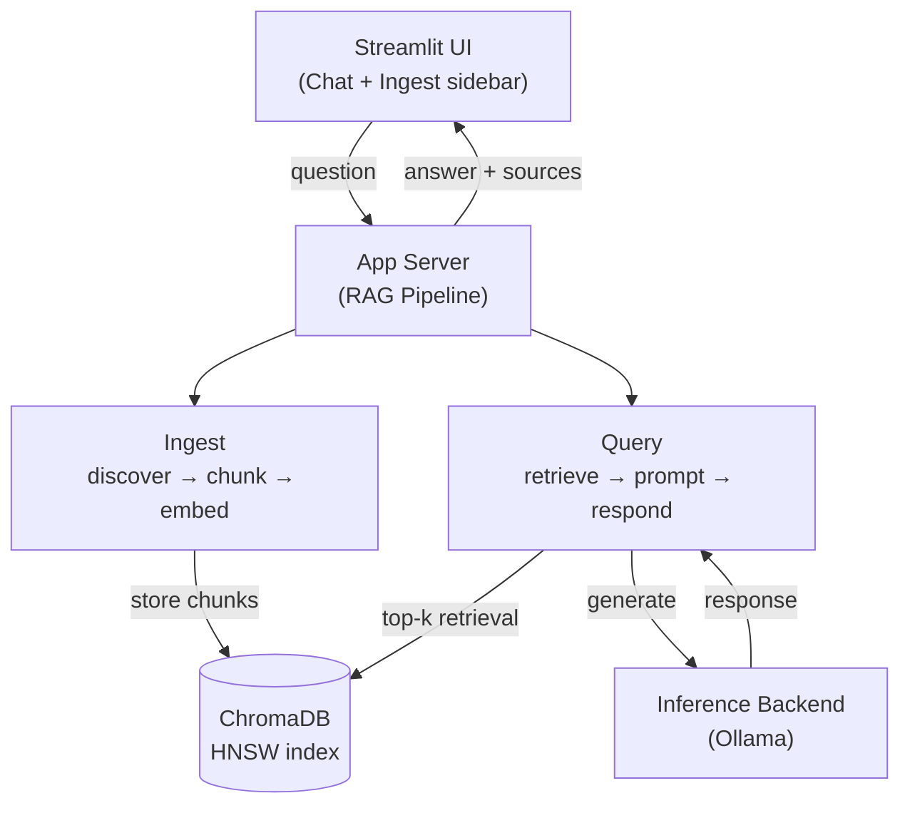
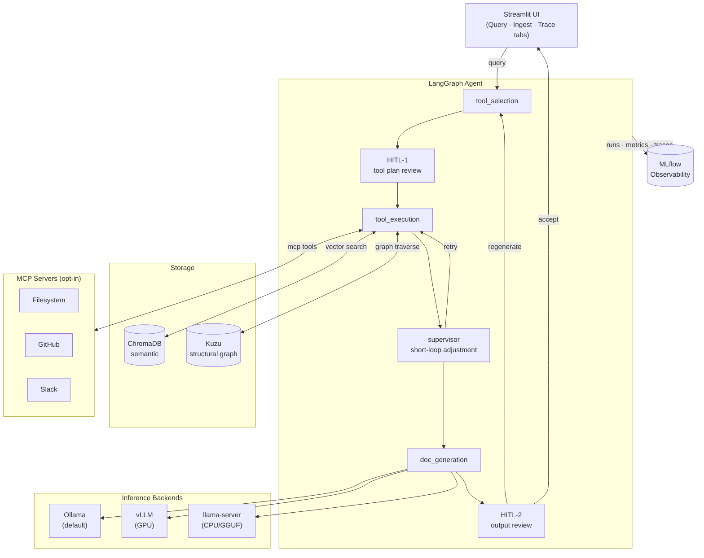
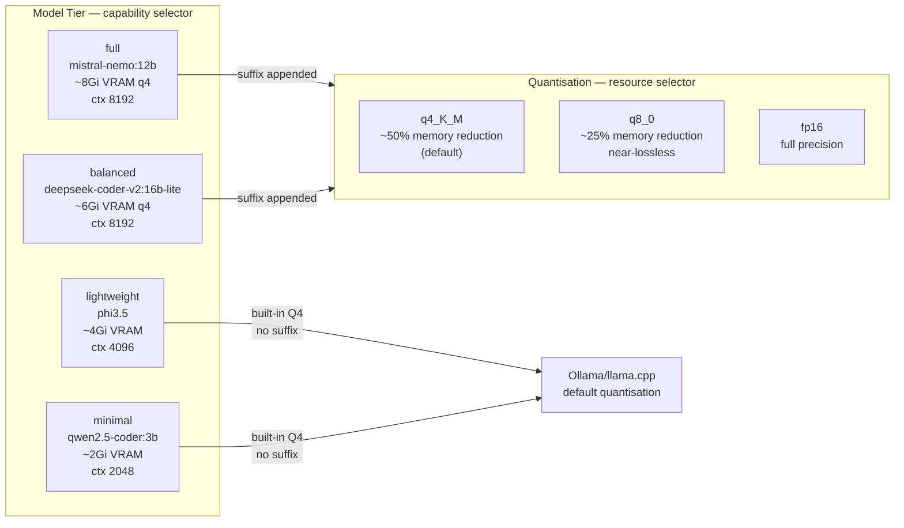
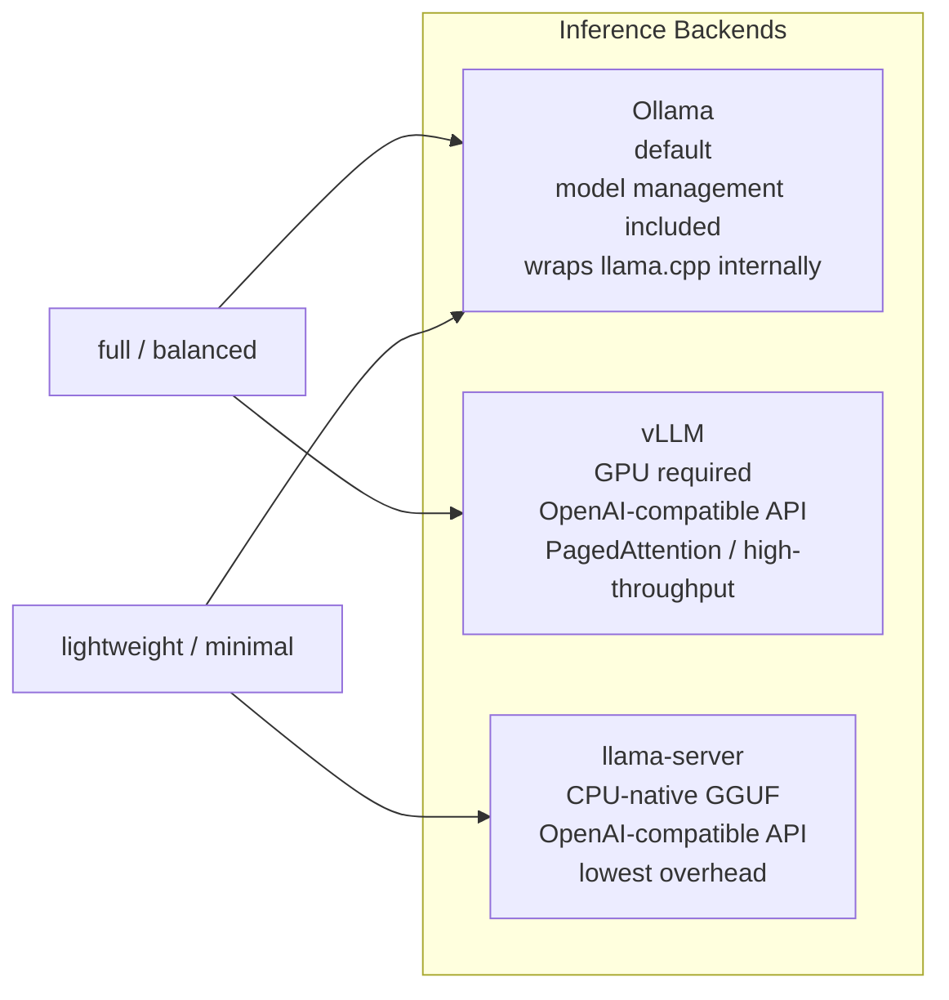
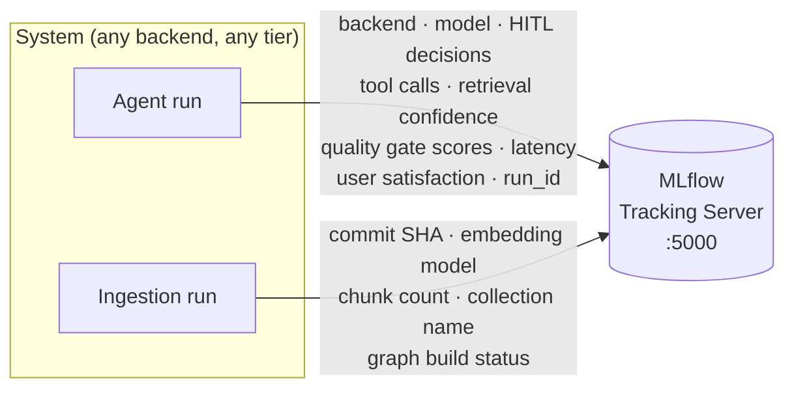
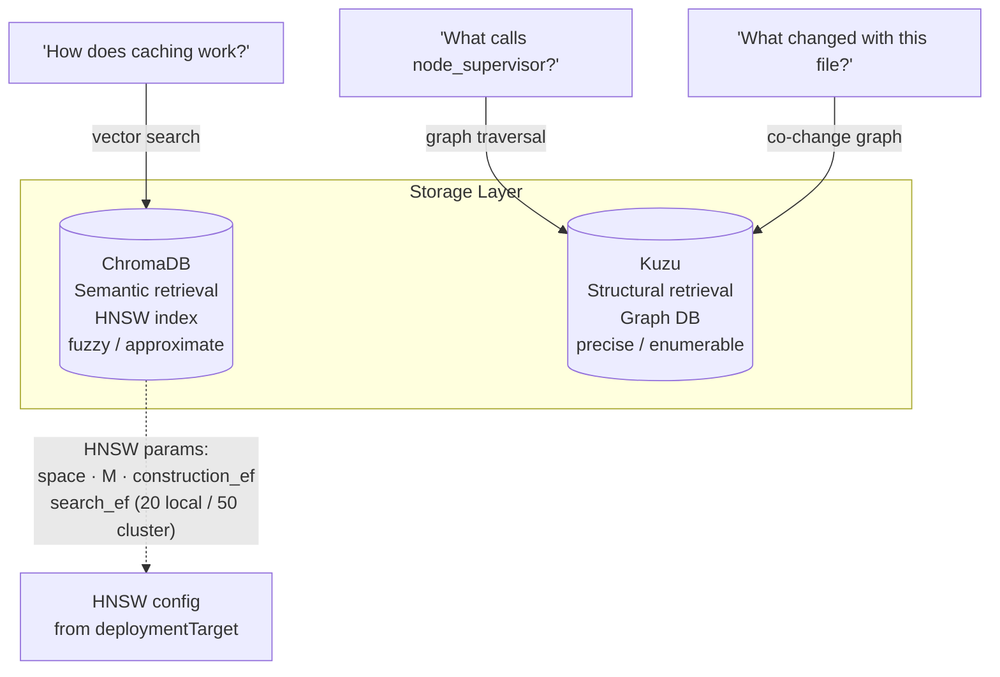
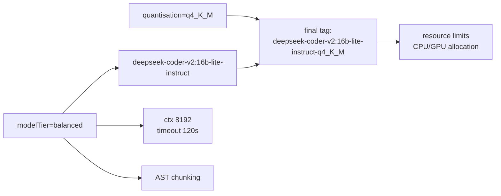
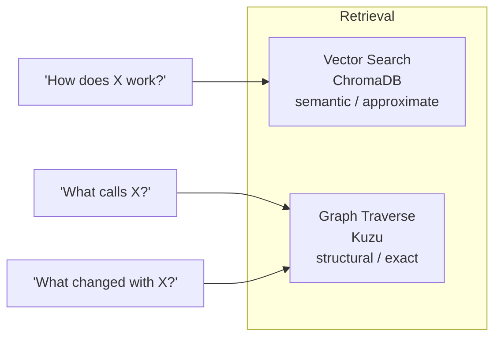

# Code Documentation Assistant

> A conversational AI assistant that ingests a codebase (GitHub repo or local files) and answers questions about the code — how it works, where functionality is implemented, API endpoints, dependencies, etc.

---

## Branch Overview

| Branch | Pipeline | Status |
|--------|----------|--------|
| `master` | LlamaIndex RAG — simple, reviewer-friendly | Stable |
| `dev` | LangGraph agent — HITL, multi-tool, graph DB, MCP | Active development |

---

## Architecture Overview

### `master` branch — LlamaIndex RAG pipeline



### `dev` branch — LangGraph agent pipeline



**MLflow** is a system-level observability layer — it logs every agent run regardless of which inference backend is active, which tools were called, how many retrieval attempts the supervisor made, what HITL decisions were recorded, and what quality gate scores were produced. It is not associated with any particular inference server.

---

## Quick Setup

### Prerequisites

- Docker & Docker Compose
- (Optional) NVIDIA GPU + drivers for full/balanced tier performance
- (Optional) A Kubernetes cluster + Helm for production deployment

---

### `master` branch — Docker Compose

```bash
git clone https://github.com/Chrisys93/code-doc-assistant.git
cd code-doc-assistant

# Quickest start (auto-detects GPU):
./run.sh

# CPU-only, lightweight tier:
MODEL_TIER=lightweight docker compose up --build

# With GPU:
docker compose -f docker-compose.yml -f docker-compose_gpu.yml up --build

# Balanced tier:
MODEL_TIER=balanced docker compose up --build

# Custom embedding model:
EMBEDDING_MODEL=all-minilm MODEL_TIER=lightweight docker compose up --build
```

Open `http://localhost:8501`. On first start, `ollama-bootstrap` pulls the model — allow a few minutes.

---

### `dev` branch — Docker Compose

The dev compose file is standalone (not an override). It adds MLflow tracking (always-on) and exposes `vllm` and `llamacpp` as optional profiles.

#### Default (Ollama, full tier, q4_K_M)

```bash
git checkout dev
docker compose -f docker-compose_dev.yml up --build

# Access:
#   http://localhost:8501  — Streamlit (Query · Ingest · Trace tabs)
#   http://localhost:5000  — MLflow tracking UI
```

#### Deployment knobs

Three orthogonal axes compose independently:

| Knob | Values | Default | Effect |
|------|--------|---------|--------|
| `MODEL_TIER` | `full` `balanced` `lightweight` `minimal` | `full` | Which model |
| `QUANTISATION` | `q4_K_M` `q8_0` `fp16` | `q4_K_M` | Memory vs quality |
| `INFERENCE_BACKEND` | `ollama` `vllm` `llamacpp` | `ollama` | Inference server |
| `DEPLOYMENT_TARGET` | `local` `cluster` | `local` | Resource profile + HNSW tuning |

```bash
# Minimal tier — tightest memory, CI pipelines
MODEL_TIER=minimal docker compose -f docker-compose_dev.yml up --build

# Balanced + q8_0 — near-lossless quality, more memory than q4
MODEL_TIER=balanced QUANTISATION=q8_0 docker compose -f docker-compose_dev.yml up --build

# Supervisor-only review (no human in the loop)
OUTPUT_REVIEW_MODE=supervisor docker compose -f docker-compose_dev.yml up --build

# Disable HITL entirely
HITL_ENABLED=false docker compose -f docker-compose_dev.yml up --build
```

#### vLLM backend (GPU required)

```bash
INFERENCE_BACKEND=vllm \
  docker compose -f docker-compose_dev.yml --profile vllm up --build
```

#### llama.cpp backend (CPU-native GGUF)

Recommended pairing: `lightweight` or `minimal` tier.

```bash
# 1. Download the GGUF model
mkdir -p models
curl -L -o models/qwen2.5-coder-3b-instruct-q4_k_m.gguf \
  https://huggingface.co/Qwen/Qwen2.5-Coder-3B-Instruct-GGUF/resolve/main/qwen2.5-coder-3b-instruct-q4_k_m.gguf

# 2. Start with the llamacpp profile
MODEL_TIER=minimal INFERENCE_BACKEND=llamacpp \
  docker compose -f docker-compose_dev.yml --profile llamacpp up --build
```

llama-server exposes the same OpenAI-compatible API as vLLM — no code changes, just a different host.

#### MCP servers (opt-in)

MCP tools are only offered to `full` and `balanced` tier models (smaller models cannot reliably produce structured MCP tool call JSON).

```bash
# Enable Slack MCP
MCP_SLACK_ENABLED=true MCP_SLACK_URL=http://your-slack-mcp:3002 \
  docker compose -f docker-compose_dev.yml up --build

# Enable GitHub MCP
MCP_GITHUB_ENABLED=true MCP_GITHUB_URL=http://your-github-mcp:3001 \
  docker compose -f docker-compose_dev.yml up --build
```

#### Graph DB (Kuzu)

Built automatically during ingestion when `GRAPH_ENABLED=true` (default). No extra services — Kuzu is embedded.

```bash
# Disable graph build
GRAPH_ENABLED=false docker compose -f docker-compose_dev.yml up --build

# Adjust co-change history depth
GRAPH_CO_CHANGE_COMMITS=200 docker compose -f docker-compose_dev.yml up --build
```

---

### Helm / Kubernetes

#### `master` branch

```bash
helm install code-doc-assistant ./helm/code-doc-assistant

# Lightweight tier
helm install code-doc-assistant ./helm/code-doc-assistant \
  --set modelTier=lightweight

# Custom combination
helm install code-doc-assistant ./helm/code-doc-assistant \
  --set modelTier=balanced \
  --set embeddingModel=lightweight
```

#### `dev` branch

```bash
# Default (full + q4_K_M + ollama + local)
helm install code-doc-assistant ./helm/code-doc-assistant

# Minimal + llamacpp
helm install code-doc-assistant ./helm/code-doc-assistant \
  --set modelTier=minimal \
  --set inferenceBackend=llamacpp

# Balanced + q8_0 + cluster profile
helm install code-doc-assistant ./helm/code-doc-assistant \
  --set modelTier=balanced \
  --set quantisation=q8_0 \
  --set deploymentTarget=cluster

# vLLM backend (GPU node required)
helm install code-doc-assistant ./helm/code-doc-assistant \
  --set inferenceBackend=vllm \
  --set modelTier=full
```

#### Access

```bash
# Single developer (port-forward)
kubectl port-forward svc/code-doc-assistant-app 8501:8501

# Team on private network (NodePort)
helm install code-doc-assistant ./helm/code-doc-assistant \
  --set app.service.type=NodePort \
  --set app.service.nodePort=30501

# Production (Ingress + TLS)
helm install code-doc-assistant ./helm/code-doc-assistant \
  --set ingress.enabled=true \
  --set ingress.hosts[0].host=docs.internal.example.com
```

---

## Model Tiers



| Tier | Model | Chunking | Backend affinity |
|------|-------|----------|-----------------|
| `full` | mistral-nemo:12b-instruct | AST | ollama / vllm |
| `balanced` | deepseek-coder-v2:16b-lite-instruct | AST | ollama / vllm |
| `lightweight` | phi3.5 | text | ollama / llamacpp |
| `minimal` | qwen2.5-coder:3b-instruct | text | llamacpp (recommended) |

---

## Inference Backends



| Backend | Profile | API | Best for |
|---------|---------|-----|----------|
| `ollama` | default | Ollama REST | All tiers; development; model management |
| `vllm` | `--profile vllm` | OpenAI-compatible | full/balanced on GPU; high-throughput |
| `llamacpp` | `--profile llamacpp` | OpenAI-compatible | lightweight/minimal on CPU; maximum control over GGUF |

---

## Observability (MLflow)

MLflow is a **system-level observability layer** — it tracks the agent pipeline as a whole, independently of which inference backend, model tier, or deployment configuration is active.



Every agent run logs: inference backend, resolved model name, HITL decisions (accept / regenerate / add context), tool calls executed, retrieval confidence scores, quality gate scores, user satisfaction rating (1–5), generation latency, and MLflow run ID. Every ingestion run logs: commit SHA, embedding model, chunk count, collection name, graph build status.

This makes MLflow run IDs traceable links between code versions, embedding indexes, and the preference data accumulated from HITL — directly relevant for the DPO training pipeline in the `orchestrated` research branch.

---

## Storage



Embedding model and HNSW parameters are set at collection creation time. Changing the embedding model requires full re-ingestion. Changing HNSW parameters requires resetting the collection.

---

## Embedding Models

⚠️ Changing the embedding model after ingestion requires full re-ingestion.

| Value | Model | Dimensions | Best for |
|-------|-------|-----------|----------|
| `nomic-embed-text` | nomic-embed-text | 768 | Default; partial-doc codebases |
| `all-minilm` | all-minilm | 384 | Lightweight; resource-constrained |
| `mxbai-embed-large` | mxbai-embed-large | 1024 | Complex, densely-documented codebases |

---

## Testing

```bash
# Full test suite (no external services required)
python test_pipeline.py

# Verbose with pytest
python -m pytest test_pipeline.py -v

# Specific class
python -m pytest test_pipeline.py::TestMinimalDeployment -v
python -m pytest test_pipeline.py::TestGraphStore -v
python -m pytest test_pipeline.py::TestInferenceBackend -v

# Smoke test (fast summary)
python test_pipeline.py smoke

# Test a specific deployment profile
MODEL_TIER=minimal INFERENCE_BACKEND=llamacpp DEPLOYMENT_TARGET=local \
  python test_pipeline.py
```

**62 tests** across 9 classes. No Ollama, ChromaDB server, MLflow, or Kuzu server required — all run in-process.

---

## Productionisation Considerations

### Cloud Resources by Model Tier

| Tier | AWS Instance | GCP Instance | GPU | System RAM | Est. Cost/hr |
|------|-------------|-------------|-----|------------|-------------|
| Full (12B, q4) | `g5.2xlarge` | `a2-highgpu-1g` | A10G 24GB | 32Gi+ | ~$1.50–$5.00 |
| Balanced (16B lite, q4) | `g5.xlarge` / `g4dn.xlarge` | `n1-standard-8` + T4 | T4 16GB | 16Gi+ | ~$0.75–$2.00 |
| Lightweight (3.8B) | `g4dn.xlarge` | `n1-standard-8` + T4 | T4 (recommended) | 8Gi+ | ~$0.50–$1.00 |
| Minimal (3B) | `c5.xlarge` | `n2-standard-4` | CPU-only | 4Gi+ | ~$0.10–$0.20 |

**Why these are larger than minimum LLM estimates**: Ollama also loads the embedding model (~274MB VRAM), ChromaDB and the Streamlit process consume additional RAM, and the OS needs headroom. Always provision one size up from the theoretical minimum.

### Scaling

- **HPA** on the app Deployment — stateless Streamlit scales horizontally
- **Ollama scaling** — multiple StatefulSet replicas, or Ray Serve for load balancing
- **Vector DB** — for large codebases, migrate from ChromaDB to managed Qdrant or Pinecone
- **Graph DB** — Kuzu is single-node embedded; for multi-agent shared state, a distributed graph DB is the right substrate

### Infrastructure & Operations

- **Observability**: MLflow tracking, structured JSON logging, Prometheus metrics
- **CI/CD**: GitHub Actions → container image → Helm upgrade; `MODEL_TIER=minimal` for CI pipeline validation runs
- **Security**: Network policies between pods, secrets management (Vault / AWS Secrets Manager), RBAC
- **Agent sandboxing**: Docker Sandboxes (GA January 2026) provide microVM-based isolation — directly relevant for a pipeline executing in proximity to proprietary codebases

### Self-Hosting vs. API Quality Trade-off

| Approach | Pros | Cons |
|----------|------|------|
| **Self-hosted (Ollama / llama.cpp)** | Full control; no API costs; code stays local | Lower quality at small param counts; GPU infrastructure required |
| **Hosted API (Claude, GPT-4)** | Highest quality reasoning; no infrastructure | API costs; code sent externally; vendor dependency |
| **Hybrid** | Best of both for simple/complex queries | More complex routing; two systems to maintain |

For a code documentation tool, keeping code local is a real-world requirement for many organisations.

---

## How AI Tools Were Used in Development

This project was developed with Claude (Anthropic) as a conversational development partner:
- **Architecture decisions** were suggested by the developer, then discussed and debated with Claude
- **Code generation** was mainly produced by Claude, with the developer reviewing, modifying, and testing all outputs
- **Documentation** was defined mainly by the developer, with table/figure generation and large formatting tasks handled by Claude

The key principle: AI tools accelerated development, but every decision and the core documentation (especially the "Evolution of thinking" sections) were made by the developer based on their own experience and judgment.

---

## Journey Log (Development Process)

This section documents the decision-making process chronologically. Each phase includes an **"Evolution of thinking"** subsection capturing how the system was developed and improved through conversation, debate, and real-world experience.

A plan was made on how to approach the development in four phases:
**1: LLM Provider Selection** | **2: Planning the pipeline** | **3: Deployment Format** | **4: Component Selection**

### Phase 1: LLM Provider Selection — Why Ollama?

**Decision: Ollama with an open-source model.**

Considerations:
- **Self-contained repo**: A reviewer can clone and run without API keys or paid accounts
- **Engineering depth**: Standing up the full inference stack showcases CI/CD, deployment, infrastructure-aware ML design
- **Privacy**: For a code documentation tool, keeping code local is a real-world requirement for many organisations

Trade-off acknowledged: hosted APIs produce higher-quality responses for complex code reasoning. A hybrid approach (local for simple queries, API fallback for complex reasoning) is the production ideal. Optimising for engineering capability was the deliberate choice here.

**Evolution of thinking:** The initial framing was "which hosted API?". The reframing: a Lead AI Engineer has broader scope than API consumption. Wrapping an API is a weekend project; the full inference stack demonstrates infrastructure ownership. Later: vLLM was added as a second backend (GPU, high-throughput) and llama.cpp/llama-server as a third (CPU-native GGUF, lowest overhead, specifically paired with `lightweight`/`minimal` tiers where it outperforms the Ollama wrapper).

### Phase 2: Planning the Approach — README-Driven Development

**Decision: README as a living design document, developed alongside the code.**

Writing the README *during* development captures the actual thought process — trade-offs, inflection points, moments where understanding shifted. Several technical choices (embedding model selection, vector DB architecture) were refined because writing them down forced sharper thinking.

### Phase 3: Deployment Format — Docker Compose AND Helm

**Decision: Both, serving different purposes.**

| | Docker Compose | Helm Chart |
|--|---------------|------------|
| Purpose | Local dev, reviewer convenience | Production-grade deployment |
| Demonstrates | "I can containerise an app" | "I think in deployable, scalable units" |

The Helm chart models the system as separate concerns: Ollama → StatefulSet, ChromaDB → StatefulSet, App → Deployment. This separation *is* the architecture, expressed as infrastructure-as-code. The three-axis knob system (`modelTier` × `quantisation` × `deploymentTarget`) on `dev` extends this composability principle to inference backend selection.

**Evolution of thinking:** Writing both forced thinking from two perspectives simultaneously. The Helm chart naturally surfaced the composability patterns (`_helpers.tpl` tier system) that wouldn't have emerged from Docker Compose alone.

### Phase 4: Component Selection

#### 4a. LLM Model — A Tiered, Configurable Approach

**Decision: Model as a configuration value, not a hard dependency.**

A single `modelTier` value cascades through the entire system: model selection, quantisation suffix, resource allocation, context window, timeouts, chunking strategy, and inference backend affinity.



| Tier | Model | Notes |
|------|-------|-------|
| `full` | mistral-nemo:12b-instruct | Best code comprehension + NL explanation |
| `balanced` | deepseek-coder-v2:16b-lite-instruct | MoE architecture; best code understanding at mid-range |
| `lightweight` | phi3.5 | Runs on almost anything; CPU-ok |
| `minimal` | qwen2.5-coder:3b-instruct | CI pipelines; very constrained machines |

*`balanced` was updated from `qwen2.5-coder:7b` — DeepSeek V2 Lite's MoE architecture is more effective for multi-language code understanding within the same memory envelope at Q4.*

#### 4b. Embedding Model

⚠️ Changing after ingestion requires full re-ingestion. The `_helpers.tpl` derives vector dimension from the embedding model choice to prevent silent failures.

Two axes characterise the input: language distribution (single vs. multi-language) and documentation state (none / partial / full). The embedding model choice follows from the input, not from infrastructure preference.

#### 4c. Vector Database + Graph Database

**Decision: ChromaDB (semantic) + Kuzu (structural) — orthogonal, not alternatives.**



For the abstraction rationale (FAISS vs ChromaDB vs Qdrant), see ARCHITECTURE.md Phase 4.

#### 4d. Orchestration

`master`: LlamaIndex RAG — purpose-built, native `CodeSplitter`, lighter weight for pure retrieval-and-respond.

`dev`: LangGraph agent — tool selection → HITL-1 → tool execution → supervisor → generation → HITL-2. The ingestion path (LlamaIndex) is unchanged on both branches.

#### 4e. Chunking Strategy

AST-based (tree-sitter) for `full`/`balanced` tiers, text-based fallback for `lightweight`/`minimal`. Resolved automatically from `modelTier` by `_helpers.tpl`. The fallback always exists as a safety net regardless of configuration.

#### 4f. Interface

`master`: single-tab chat UI with sidebar ingestion controls.

`dev`: three tabs — **Query** (chat + HITL panels), **Ingest** (repo ingestion with graph build toggle), **Trace** (LangGraph execution trace with node highlighting).

#### 4g. RAG Quality and Limitations

RAG is not unconditionally beneficial — retrieval noise can actively degrade quality. Code-specific risks: stale context, partial context (function without imports), cross-file naming confusion. Mitigations: similarity score cutoff (0.3), metadata preservation, source attribution. On `dev`, the supervisor adjusts retrieval parameters between attempts based on confidence scores.

#### 4h. Guardrails

Domain-specific for code documentation: hallucination prevention (prompt-level + source attribution), credential redaction (flagged as production requirement). Source attribution is itself a guardrail — the developer can verify claims against actual code.

### Phase 5: Implementation

Key outcomes:
- Python modules: `config.py`, `vector_store.py`, `ingest.py`, `query_engine.py`, `app.py` (master); + `agent_graph.py`, `agent_state.py`, `tools.py`, `graph_store.py` (dev)
- ChromaDB HNSW parameters now explicitly tuned (M, construction_ef, search_ef) — not left at defaults
- Split tool registry: local tools always available; MCP tools gated by `is_mcp_capable()` and server enabled flag
- Three inference backends: Ollama (default), vLLM (GPU), llama-server/llama.cpp (CPU-native GGUF)
- MLflow as system-level observability: logs every agent run and every ingestion run independently of backend

### Phase 6: Testing & Refinement

**62 tests, 9 classes, no external services required.**

Bugs found during test authoring that would have caused silent production failures:
1. Kuzu `mkdir` before init → "cannot be a directory" error
2. Kuzu `reset()` used `shutil.rmtree` on a file, not a directory
3. `end` is a reserved word in Kuzu Cypher → parser exception
4. Top-level Ollama import in `ingest.py` → import failure in test environments

**Evolution of thinking:** The test suite was designed to exercise as much of the codebase as possible without external services. The bugs found — particularly the Kuzu reserved word and the `reset()` file-vs-directory issue — would have been invisible until first deployment.

---

## What I'd Do Differently With More Time

### Model Fine-Tuning

On `dev`, the HITL feedback loop accumulates preference pairs (chosen vs rejected responses) into MLflow — a DPO-compatible preference dataset generated passively. The `orchestrated` research branch closes this into a proper RLHF loop (DPO + soft prompt tuning).

### Advanced RAG Mitigations

CRAG, Self-RAG, re-ranking, and GraphRAG (graph traversal to identify structural neighbourhood, then vector search within it).

### Graph-Aware Retrieval

The code dependency graph (`dev`) is the first layer. The knowledge graph — concepts, design decisions, architectural components — is the research extension. See `RESEARCH_orchestrated.md` for the full treatment of upward/downward/lateral structure transition dynamics.

### With Known Infrastructure: vLLM, Quantisation, Production Inference

In a production environment with known GPU topology: vLLM continuous batching + PagedAttention, INT8/INT4 inference on Ampere/Turing, tensor parallelism, NVLink for multi-GPU communication, RDMA/InfiniBand for inter-node model parallelism. These are the infrastructure decisions that separate a working prototype from a production system.

---

## Engineering Standards

- **Python 3.11+**, type hints throughout
- **Modular design**: each source file maps to a single concern
- **Abstraction layers**: vector store interface; tool registry split (local/MCP)
- **Configuration**: environment-variable driven, full parity between Docker Compose and Helm
- **Testing**: 62 unit tests, no external services, covers all new components
- **Observability**: MLflow for system-level experiment tracking; structured logging; configurable log level

---

## Reviewer Note

I am willing to provide the full conversation transcripts from the development sessions with Claude, which helped develop this project. These transcripts show the unedited back-and-forth — including corrections and the moments where ideas were realigned — and provide additional context for the decision-making documented in this Journey Log.
