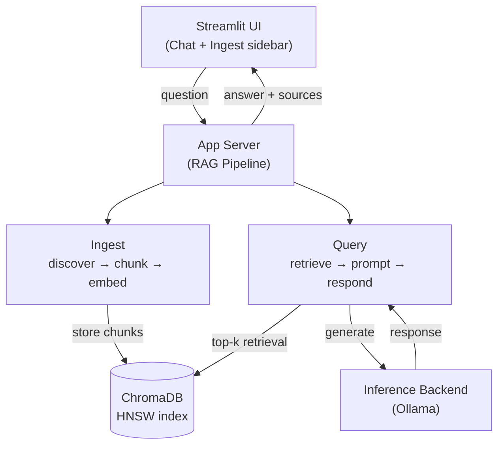
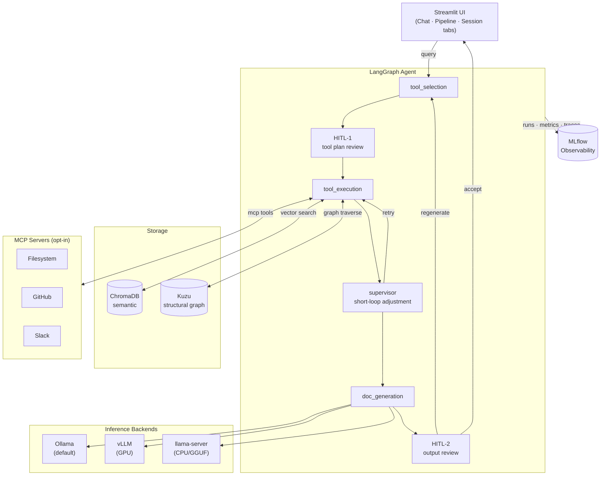
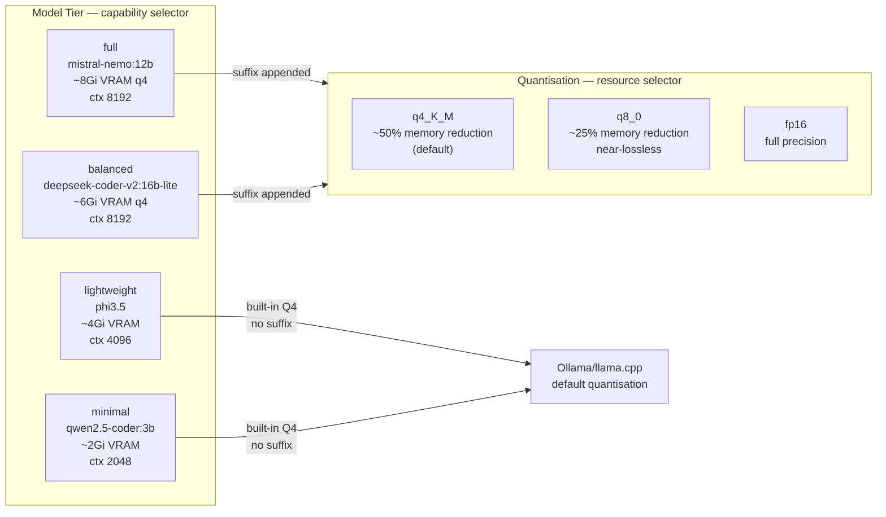
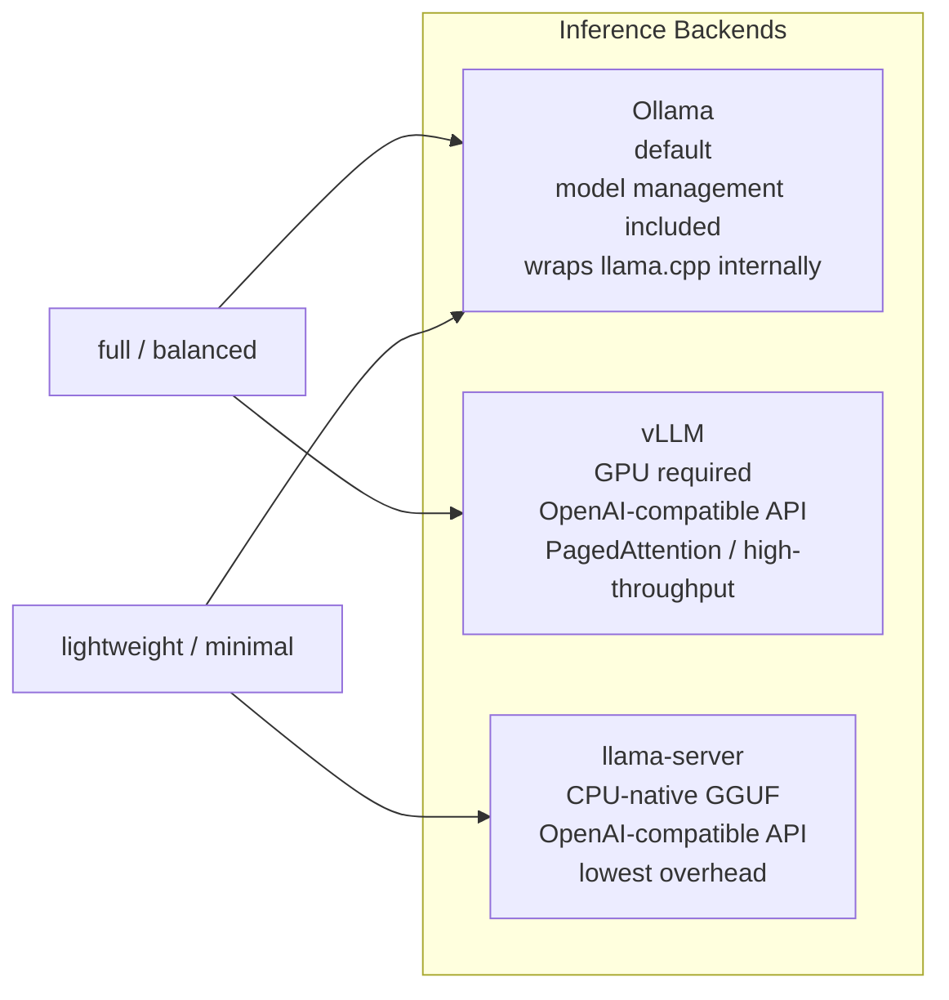
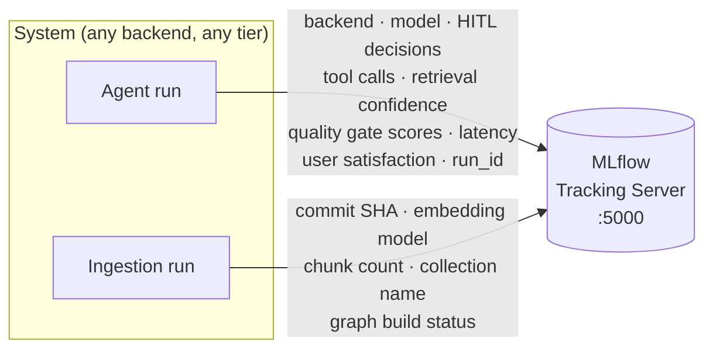
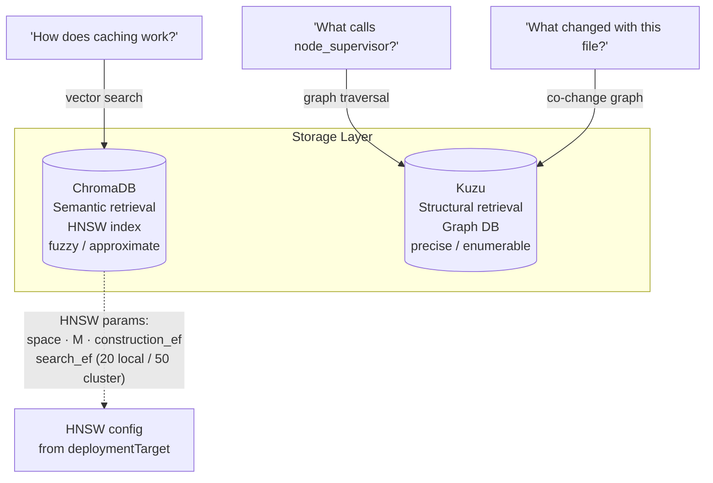

# Code Documentation Assistant

> A conversational AI assistant that ingests a codebase (GitHub repo or local files) and answers questions about the code — how it works, where functionality is implemented, API endpoints, dependencies, etc.

---

## Branch Overview

| Branch | Pipeline | Status |
|--------|----------|--------|
| `master` | LlamaIndex RAG — simple, reviewer-friendly | Stable |
| `dev` | LangGraph agent — HITL, multi-tool, multi-repo (per-repo collections, fair-merge retrieval), graph DB, MCP | Active development |

---

## Architecture Overview

### `master` branch — LlamaIndex RAG pipeline



### `dev` branch — LangGraph agent pipeline



**MLflow** is a system-level observability layer — it logs every agent run regardless of which inference backend is active, which tools were called, how many retrieval attempts the supervisor made, what HITL decisions were recorded, and what quality gate scores were produced. It is not associated with any particular inference server.

**Multi-repo retrieval.** `TE <-->|vector search| CHROMA` above is per-repo, not global: each repo (GitHub URL or local path) is embedded into its own ChromaDB collection — one embedding model, many collections, so repos share a vector space but stay isolated at retrieval time. A deterministic gate (`repo_index.py`) ensures every repo entered is indexed before a query runs (idempotent — already-indexed repos are skipped in ~milliseconds). When a query spans multiple repos, `vector_search` merges results across their collections with **fair per-repo representation**: chunks are interleaved by within-collection rank rather than pooled by raw score, so a larger or more semantically "central" repo can't crowd a smaller one out of the context window. See [Multi-Repo Retrieval](#multi-repo-retrieval) below.

---

## Quick Setup

### Prerequisites

- Docker & Docker Compose
- (Optional) NVIDIA GPU + drivers for full/balanced tier performance
- (Optional) A Kubernetes cluster + Helm for production deployment

---

### `master` branch — Docker Compose

```bash
git clone https://github.com/Chrisys93/code-doc-assistant.git
cd code-doc-assistant

# Quickest start (auto-detects GPU):
./run.sh

# CPU-only, lightweight tier:
MODEL_TIER=lightweight docker compose up --build

# With GPU:
docker compose -f docker-compose.yml -f docker-compose_gpu.yml up --build

# Balanced tier:
MODEL_TIER=balanced docker compose up --build

# Custom embedding model:
EMBEDDING_MODEL=all-minilm MODEL_TIER=lightweight docker compose up --build
```

Open `http://localhost:8501`. On first start, `ollama-bootstrap` pulls the model — allow a few minutes.

---

### `dev` branch — Docker Compose

The dev overlay (`docker-compose.dev.yml`) layers on the base compose file — same pattern as the GPU overlay — adding MLflow tracking and live `./src` reload. It does not redeclare `ollama`/`chromadb`/`app` from scratch.

MLflow sits behind the `observability` profile in the base file (so a bare `docker compose up` stays lightweight by default). The dev overlay's `app` service depends on `mlflow`, so the profile must be active — set it once in `.env` and forget it:

```bash
echo "COMPOSE_PROFILES=observability" >> .env
```

#### Default (Ollama, full tier, q4_K_M)

```bash
git checkout dev

# GPU:
docker compose -f docker-compose.yml -f docker-compose.gpu.yml -f docker-compose.dev.yml up --build
# CPU:
docker compose -f docker-compose.yml -f docker-compose.dev.yml up --build
# or just:
./run-dev.sh

# Access:
#   http://localhost:8501  — Streamlit (Chat · Pipeline · Session tabs)
#   http://localhost:5000  — MLflow tracking UI
```

#### Multiple repositories

Enter one or more repos (GitHub URLs or local paths), one per line, in the **Repos** field. Each is deterministically indexed into its own ChromaDB collection before the query runs — you'll see a `📂 <repo> → indexed (N docs)` line per repo. Cross-repo questions retrieve from all active collections with fair per-repo representation (see [Multi-Repo Retrieval](#multi-repo-retrieval)).

`TOP_K` (default `10`) is the total chunks returned **across all active collections combined** — fair-merge splits this across repos, so raise it if a multi-repo query needs more per-repo coverage:

```bash
TOP_K=15 docker compose -f docker-compose.yml -f docker-compose.gpu.yml -f docker-compose.dev.yml up --build
```

#### Deployment knobs

Three orthogonal axes compose independently:

| Knob | Values | Default | Effect |
|------|--------|---------|--------|
| `MODEL_TIER` | `full` `balanced` `lightweight` `minimal` | `full` | Which model |
| `QUANTISATION` | `q4_K_M` `q8_0` `fp16` | `q4_K_M` | Memory vs quality |
| `INFERENCE_BACKEND` | `ollama` `vllm` `llamacpp` | `ollama` | Inference server |
| `DEPLOYMENT_TARGET` | `local` `cluster` | `local` | Resource profile + HNSW tuning |

```bash
# Minimal tier — tightest memory, CI pipelines
MODEL_TIER=minimal docker compose -f docker-compose.yml -f docker-compose.dev.yml up --build

# Balanced + q8_0 — near-lossless quality, more memory than q4
MODEL_TIER=balanced QUANTISATION=q8_0 docker compose -f docker-compose.yml -f docker-compose.dev.yml up --build

# Supervisor-only review (no human in the loop)
OUTPUT_REVIEW_MODE=supervisor docker compose -f docker-compose.yml -f docker-compose.dev.yml up --build

# Disable HITL entirely
HITL_ENABLED=false docker compose -f docker-compose.yml -f docker-compose.dev.yml up --build
```

Both `HITL_ENABLED` and `OUTPUT_REVIEW_MODE` are also live UI toggles (Configuration panel) — the env var sets the session default; the toggle overrides it per-query, read fresh from state on every request.

#### vLLM backend (GPU required)

```bash
INFERENCE_BACKEND=vllm \
  docker compose -f docker-compose.yml -f docker-compose.gpu.yml -f docker-compose.dev.yml --profile vllm up --build
```

#### llama.cpp backend (CPU-native GGUF)

Recommended pairing: `lightweight` or `minimal` tier.

```bash
# 1. Download the GGUF model
mkdir -p models
curl -L -o models/qwen2.5-coder-3b-instruct-q4_k_m.gguf \
  https://huggingface.co/Qwen/Qwen2.5-Coder-3B-Instruct-GGUF/resolve/main/qwen2.5-coder-3b-instruct-q4_k_m.gguf

# 2. Start with the llamacpp profile
MODEL_TIER=minimal INFERENCE_BACKEND=llamacpp \
  docker compose -f docker-compose.yml -f docker-compose.dev.yml --profile llamacpp up --build
```

llama-server exposes the same OpenAI-compatible API as vLLM — no code changes, just a different host.

#### MCP servers (opt-in)

MCP tools are only offered to `full` and `balanced` tier models (smaller models cannot reliably produce structured MCP tool call JSON).

```bash
# Enable Slack MCP
MCP_SLACK_ENABLED=true MCP_SLACK_URL=http://your-slack-mcp:3002 \
  docker compose -f docker-compose.yml -f docker-compose.dev.yml up --build

# Enable GitHub MCP
MCP_GITHUB_ENABLED=true MCP_GITHUB_URL=http://your-github-mcp:3001 \
  docker compose -f docker-compose.yml -f docker-compose.dev.yml up --build
```

#### Graph DB (Kuzu)

Built automatically during ingestion when `GRAPH_ENABLED=true` (default). No extra services — Kuzu is embedded.

> Multi-repo note: the graph currently builds to a single shared path (`GRAPH_PATH`), so ingesting a second repo rebuilds it — the graph reflects the most recently ingested repo, not a merged view. ChromaDB is unaffected (per-repo collections are independent). Per-repo graph paths, or a repo-tagged shared graph for cross-repo structural queries, is a planned enhancement — see [Roadmap](#roadmap).

```bash
# Disable graph build
GRAPH_ENABLED=false docker compose -f docker-compose.yml -f docker-compose.dev.yml up --build

# Adjust co-change history depth
GRAPH_CO_CHANGE_COMMITS=200 docker compose -f docker-compose.yml -f docker-compose.dev.yml up --build
```

---

### Helm / Kubernetes

#### `master` branch

```bash
helm install code-doc-assistant ./helm/code-doc-assistant

# Lightweight tier
helm install code-doc-assistant ./helm/code-doc-assistant \
  --set modelTier=lightweight

# Custom combination
helm install code-doc-assistant ./helm/code-doc-assistant \
  --set modelTier=balanced \
  --set embeddingModel=lightweight
```

#### `dev` branch

```bash
# Default (full + q4_K_M + ollama + local)
helm install code-doc-assistant ./helm/code-doc-assistant

# Minimal + llamacpp
helm install code-doc-assistant ./helm/code-doc-assistant \
  --set modelTier=minimal \
  --set inferenceBackend=llamacpp

# Balanced + q8_0 + cluster profile
helm install code-doc-assistant ./helm/code-doc-assistant \
  --set modelTier=balanced \
  --set quantisation=q8_0 \
  --set deploymentTarget=cluster

# vLLM backend (GPU node required)
helm install code-doc-assistant ./helm/code-doc-assistant \
  --set inferenceBackend=vllm \
  --set modelTier=full
```

#### Access

```bash
# Single developer (port-forward)
kubectl port-forward svc/code-doc-assistant-app 8501:8501

# Team on private network (NodePort)
helm install code-doc-assistant ./helm/code-doc-assistant \
  --set app.service.type=NodePort \
  --set app.service.nodePort=30501

# Production (Ingress + TLS)
helm install code-doc-assistant ./helm/code-doc-assistant \
  --set ingress.enabled=true \
  --set ingress.hosts[0].host=docs.internal.example.com
```

---

## Model Tiers



| Tier | Model | Chunking | Backend affinity |
|------|-------|----------|-----------------|
| `full` | mistral-nemo:12b-instruct | AST | ollama / vllm |
| `balanced` | deepseek-coder-v2:16b-lite-instruct | AST | ollama / vllm |
| `lightweight` | phi3.5 | text | ollama / llamacpp |
| `minimal` | qwen2.5-coder:3b-instruct | text | llamacpp (recommended) |

---

## Inference Backends



| Backend | Profile | API | Best for |
|---------|---------|-----|----------|
| `ollama` | default | Ollama REST | All tiers; development; model management |
| `vllm` | `--profile vllm` | OpenAI-compatible | full/balanced on GPU; high-throughput |
| `llamacpp` | `--profile llamacpp` | OpenAI-compatible | lightweight/minimal on CPU; maximum control over GGUF |

---

## Observability (MLflow)

MLflow is a **system-level observability layer** — it tracks the agent pipeline as a whole, independently of which inference backend, model tier, or deployment configuration is active.



Every agent run logs: inference backend, resolved model name, HITL decisions (accept / regenerate / add context), tool calls executed, retrieval confidence scores, quality gate scores, user satisfaction rating (1–5), generation latency, and MLflow run ID. Every ingestion run logs: commit SHA, embedding model, chunk count, collection name, graph build status.

This makes MLflow run IDs traceable links between code versions, embedding indexes, and the preference data accumulated from HITL — directly relevant for the DPO training pipeline in the `orchestrated` research branch.

---

## Storage



Embedding model and HNSW parameters are set at collection creation time. Changing the embedding model requires full re-ingestion. Changing HNSW parameters requires resetting the collection.

---

## Embedding Models

⚠️ Changing the embedding model after ingestion requires full re-ingestion.

| Value | Model | Dimensions | Best for |
|-------|-------|-----------|----------|
| `nomic-embed-text` | nomic-embed-text | 768 | Default; partial-doc codebases |
| `all-minilm` | all-minilm | 384 | Lightweight; resource-constrained |
| `mxbai-embed-large` | mxbai-embed-large | 1024 | Complex, densely-documented codebases |

---

## Multi-Repo Retrieval

Enter one or more repos (GitHub URL or local path) in the Streamlit **Repos** field, one per line. Each is deterministically indexed before any query runs — indexing is *not* left to the agent to decide; a plain pre-query gate (`repo_index.py`) guarantees every listed repo exists in the vector store, idempotently (already-indexed repos are skipped, checked in milliseconds).

**Design.**
- **One embedding model, many collections.** Every repo is embedded with the same model — the same shared vector space — but stored in its own ChromaDB collection (`repo_<slug>_<hash>`, deterministic per repo ref, collision-resistant via a short hash of the full URL/path). Isolation is at the retrieval layer, not the embedding layer.
- **Fair-merge retrieval.** `vector_search` accepts a `collections` list and merges results by interleaving within-collection rank — repo A's best chunk, repo B's best chunk, repo A's 2nd-best, and so on — rather than pooling all chunks and sorting by raw score. Pooled-by-score merging silently favours whichever repo's content happens to score higher on a given query (larger corpus, more central-vocabulary domain), which can starve a smaller or more tangential repo out of the context window entirely even when it's the one the question is actually about. Fair-merge guarantees every active repo gets representation proportional to `top_k`, not to its raw score.
- **`TOP_K` is a total, not a per-repo count** (default `10`, `config.py`/env-driven). Fair-merge splits it across active collections — a 2-repo query gets up to 5 slots each; raise `TOP_K` for multi-repo queries that need more per-repo coverage, at the usual recall/precision-and-context-budget trade-off.
- **Tool-selection is told the index exists.** The tool-selection prompt receives the active collection list explicitly (`Indexed repos (already embedded, use vector_search): ...`) and is instructed to prefer `vector_search` over single-file tools like `github_fetch` for already-indexed repos — without this, a capable model will still reasonably reach for fetching a README to "learn about" a repo it doesn't know is already searchable.

**Not yet implemented:** cross-repo *structural* queries (the Kuzu graph is currently single-repo — see the Graph DB note under Quick Setup) and non-blocking first-time ingestion (adding a new, unindexed repo mid-session blocks the query until it's cloned and embedded, ~30–60s for a typical repo).

---

## Testing

```bash
# Full test suite (no external services required)
python test_pipeline.py

# Verbose with pytest
python -m pytest test_pipeline.py -v

# Specific class
python -m pytest test_pipeline.py::TestMinimalDeployment -v
python -m pytest test_pipeline.py::TestGraphStore -v
python -m pytest test_pipeline.py::TestInferenceBackend -v

# Smoke test (fast summary)
python test_pipeline.py smoke

# Test a specific deployment profile
MODEL_TIER=minimal INFERENCE_BACKEND=llamacpp DEPLOYMENT_TARGET=local \
  python test_pipeline.py
```

**62 tests** across 9 classes. No Ollama, ChromaDB server, MLflow, or Kuzu server required — all run in-process.

---

## Productionisation Considerations

### Cloud Resources by Model Tier

| Tier | AWS Instance | GCP Instance | GPU | System RAM | Est. Cost/hr |
|------|-------------|-------------|-----|------------|-------------|
| Full (12B, q4) | `g5.2xlarge` | `a2-highgpu-1g` | A10G 24GB | 32Gi+ | ~$1.50–$5.00 |
| Balanced (16B lite, q4) | `g5.xlarge` / `g4dn.xlarge` | `n1-standard-8` + T4 | T4 16GB | 16Gi+ | ~$0.75–$2.00 |
| Lightweight (3.8B) | `g4dn.xlarge` | `n1-standard-8` + T4 | T4 (recommended) | 8Gi+ | ~$0.50–$1.00 |
| Minimal (3B) | `c5.xlarge` | `n2-standard-4` | CPU-only | 4Gi+ | ~$0.10–$0.20 |

**Why these are larger than minimum LLM estimates**: Ollama also loads the embedding model (~274MB VRAM), ChromaDB and the Streamlit process consume additional RAM, and the OS needs headroom. Always provision one size up from the theoretical minimum.

### Scaling

- **HPA** on the app Deployment — stateless Streamlit scales horizontally
- **Ollama scaling** — multiple StatefulSet replicas, or Ray Serve for load balancing
- **Vector DB** — for large codebases, migrate from ChromaDB to managed Qdrant or Pinecone
- **Graph DB** — Kuzu is single-node embedded; for multi-agent shared state, a distributed graph DB is the right substrate

### Infrastructure & Operations

- **Observability**: MLflow tracking, structured JSON logging, Prometheus metrics
- **CI/CD**: GitHub Actions → container image → Helm upgrade; `MODEL_TIER=minimal` for CI pipeline validation runs
- **Security**: Network policies between pods, secrets management (Vault / AWS Secrets Manager), RBAC
- **Agent sandboxing**: Docker Sandboxes (GA January 2026) provide microVM-based isolation — directly relevant for a pipeline executing in proximity to proprietary codebases

### Self-Hosting vs. API Quality Trade-off

| Approach | Pros | Cons |
|----------|------|------|
| **Self-hosted (Ollama / llama.cpp)** | Full control; no API costs; code stays local | Lower quality at small param counts; GPU infrastructure required |
| **Hosted API (Claude, GPT-4)** | Highest quality reasoning; no infrastructure | API costs; code sent externally; vendor dependency |
| **Hybrid** | Best of both for simple/complex queries | More complex routing; two systems to maintain |

For a code documentation tool, keeping code local is a real-world requirement for many organisations.

---

*For the full phase-by-phase design rationale — including the agent graph design, tool registry, inference backend factory, MLflow, Argo Workflows, the RLHF preference-learning pipeline, Helm deployment knobs, MCP integration, the graph database, and testing infrastructure (18 phases in total) — see [ARCHITECTURE.md](./ARCHITECTURE.md). For the multi-repo port done afterward and the failure modes hit getting it working end-to-end, see [DEBUGGING_JOURNEY.md](./DEBUGGING_JOURNEY.md), organised by layer (config vs. execution seam) rather than chronologically.*

## Roadmap

### Model Fine-Tuning

On `dev`, the HITL feedback loop accumulates preference pairs (chosen vs rejected responses) into MLflow — a DPO-compatible preference dataset generated passively. The `orchestrated` research branch closes this into a proper RLHF loop (DPO + soft prompt tuning).

### Advanced RAG Mitigations

CRAG, Self-RAG, re-ranking, and GraphRAG (graph traversal to identify structural neighbourhood, then vector search within it).

### Graph-Aware Retrieval

The code dependency graph (`dev`) is the first layer. The knowledge graph — concepts, design decisions, architectural components — is the research extension. See `RESEARCH_orchestrated.md` for the full treatment of upward/downward/lateral structure transition dynamics.

**Multi-repo graph.** The graph currently builds to one shared path, so it reflects only the most recently ingested repo (see the Graph DB note under Quick Setup). The natural extension once multi-repo retrieval is stable: either per-repo graph paths (mirroring the per-repo ChromaDB collections — low-risk, no cross-repo structural reasoning) or a single repo-tagged graph enabling genuinely cross-repo structural queries ("what in repo A would break if repo B's interface changed?") — the more interesting version, and a deliberate next step rather than an accidental side effect of the multi-repo port.

### With Known Infrastructure: vLLM, Quantisation, Production Inference

In a production environment with known GPU topology: vLLM continuous batching + PagedAttention, INT8/INT4 inference on Ampere/Turing, tensor parallelism, NVLink for multi-GPU communication, RDMA/InfiniBand for inter-node model parallelism. These are the infrastructure decisions that separate a working prototype from a production system.

---

## Engineering Standards

- **Python 3.11+**, type hints throughout
- **Modular design**: each source file maps to a single concern
- **Abstraction layers**: vector store interface; tool registry split (local/MCP)
- **Configuration**: environment-variable driven, full parity between Docker Compose and Helm
- **Testing**: 62 unit tests, no external services, covers all new components
- **Observability**: MLflow for system-level experiment tracking; structured logging; configurable log level
