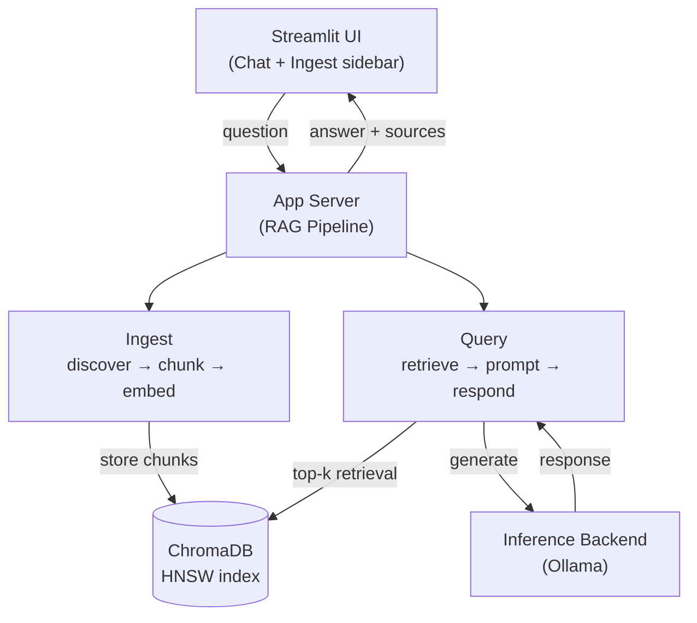
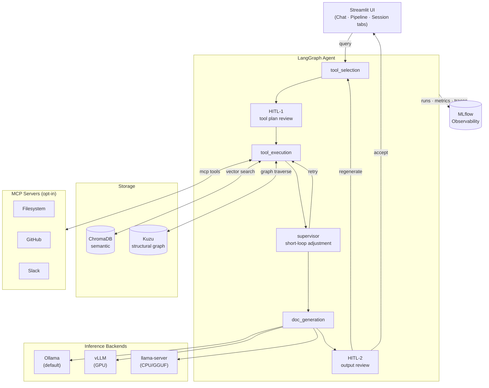
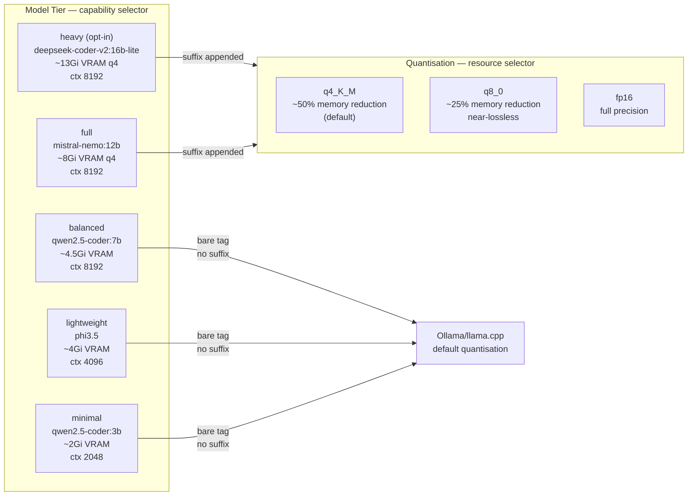
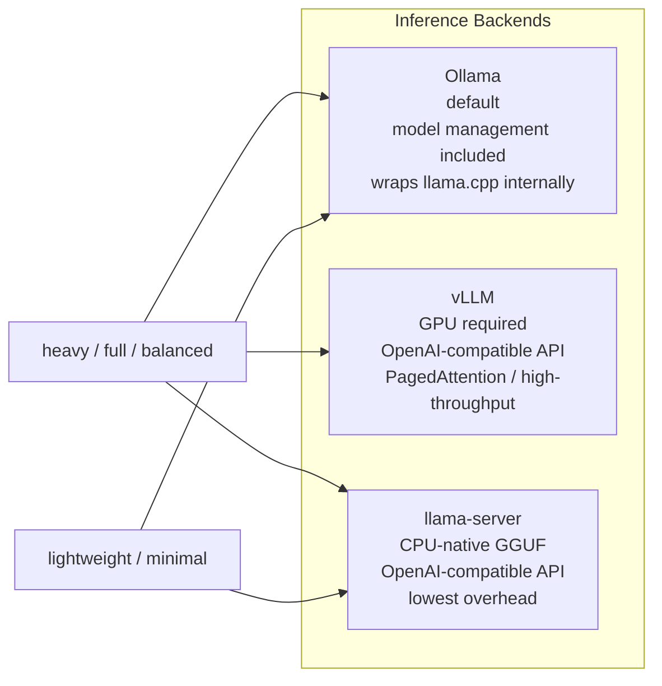
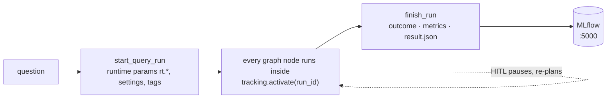
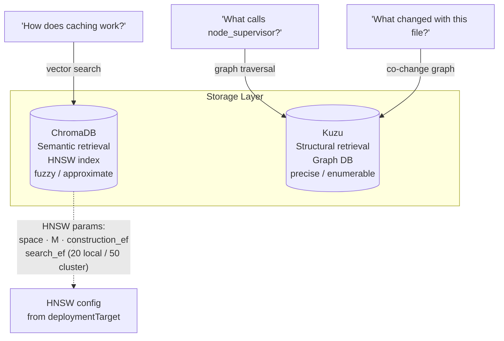

# Code Documentation Assistant

> A conversational AI assistant that ingests a codebase (GitHub repo or local files) and answers questions about the code — how it works, where functionality is implemented, API endpoints, dependencies, etc.

---

## Branch Overview

| Branch | Pipeline | Status |
|--------|----------|--------|
| `master` | LlamaIndex RAG — simple, reviewer-friendly | Stable |
| `dev` | LangGraph agent — HITL, multi-tool, multi-repo (per-repo collections, fair-merge retrieval), graph DB, MCP | Active development |

---

## Architecture Overview

### `master` branch — LlamaIndex RAG pipeline


```mermaid
flowchart TD
    UI["Streamlit UI\n(Chat + Ingest sidebar)"]
    APP["App Server\n(RAG Pipeline)"]
    INGEST["Ingest\ndiscover → chunk → embed"]
    QUERY["Query\nretrieve → prompt → respond"]
    CHROMA[("ChromaDB\nHNSW index")]
    OLLAMA["Inference Backend\n(Ollama)"]

    UI -->|question| APP
    APP -->|answer + sources| UI
    APP --> INGEST
    APP --> QUERY
    INGEST -->|store chunks| CHROMA
    QUERY -->|top-k retrieval| CHROMA
    QUERY -->|generate| OLLAMA
    OLLAMA -->|response| QUERY
```

### `dev` branch — LangGraph agent pipeline


```mermaid
flowchart TD
    UI["Streamlit UI\n(Chat · Pipeline · Session tabs)"]
    AGENT["LangGraph Agent"]

    subgraph AGENT["LangGraph Agent"]
        TS["tool_selection"]
        HITL1["HITL-1\ntool plan review"]
        TE["tool_execution"]
        SUP["supervisor\nshort-loop adjustment"]
        GEN["doc_generation"]
        HITL2["HITL-2\noutput review"]
    end

    subgraph STORAGE["Storage"]
        CHROMA[("ChromaDB\nsemantic")]
        KUZU[("Kuzu\nstructural graph")]
    end

    subgraph BACKENDS["Inference Backends"]
        OLLAMA["Ollama\n(default)"]
        VLLM["vLLM\n(GPU)"]
        LLAMA["llama-server\n(CPU/GGUF)"]
    end

    subgraph MCP["MCP Servers (opt-in)"]
        FS["Filesystem"]
        GH["GitHub"]
        SLACK["Slack"]
    end

    MLFLOW[("MLflow\nObservability")]

    UI -->|query| TS
    TS --> HITL1
    HITL1 --> TE
    TE --> SUP
    SUP -->|retry| TE
    SUP --> GEN
    GEN --> HITL2
    HITL2 -->|regenerate| TS
    HITL2 -->|accept| UI

    TE <-->|vector search| CHROMA
    TE <-->|graph traverse| KUZU
    TE <-->|mcp tools| MCP

    GEN --> OLLAMA
    GEN --> VLLM
    GEN --> LLAMA

    AGENT -->|runs · metrics · traces| MLFLOW
```

**MLflow** is a system-level observability layer — it logs every agent run regardless of which inference backend is active, which tools were called, how many retrieval attempts the supervisor made, what HITL decisions were recorded, and what quality gate scores were produced. It is not associated with any particular inference server.

**Multi-repo retrieval.** `TE <-->|vector search| CHROMA` above is per-repo, not global: each repo (GitHub URL or local path) is embedded into its own ChromaDB collection — one embedding model, many collections, so repos share a vector space but stay isolated at retrieval time. A deterministic gate (`repo_index.py`) ensures every repo entered is indexed before a query runs (idempotent — already-indexed repos are skipped in ~milliseconds). When a query spans multiple repos, `vector_search` merges results across their collections with **fair per-repo representation**: chunks are interleaved by within-collection rank rather than pooled by raw score, so a larger or more semantically "central" repo can't crowd a smaller one out of the context window. See [Multi-Repo Retrieval](#multi-repo-retrieval) below.

---

## Quick Setup

### Prerequisites

- Docker & Docker Compose
- (Optional) NVIDIA GPU + drivers for full/heavy tier performance
- (Optional) A Kubernetes cluster + Helm for production deployment

---

### `master` branch — Docker Compose

```bash
git clone https://github.com/Chrisys93/code-doc-assistant.git
cd code-doc-assistant

# Quickest start (auto-detects GPU):
./run.sh

# CPU-only, lightweight tier:
MODEL_TIER=lightweight docker compose up --build

# With GPU:
docker compose -f docker-compose.yml -f docker-compose_gpu.yml up --build

# Balanced tier:
MODEL_TIER=balanced docker compose up --build

# Custom embedding model:
EMBEDDING_MODEL=all-minilm MODEL_TIER=lightweight docker compose up --build
```

Open `http://localhost:8501`. On first start, `ollama-bootstrap` pulls the model — allow a few minutes.

---

### `dev` branch — Docker Compose

The dev overlay (`docker-compose.dev.yml`) layers on the base compose file — same pattern as the GPU overlay — adding MLflow tracking and live `./src` reload. It does not redeclare `ollama`/`chromadb`/`app` from scratch.

MLflow sits behind the `observability` profile in the base file (so a bare `docker compose up` stays lightweight by default). The dev overlay's `app` service depends on `mlflow`, so the profile must be active — set it once in `.env` and forget it:

```bash
echo "COMPOSE_PROFILES=observability" >> .env
```

#### Default (Ollama, full tier, q4_K_M)

```bash
git checkout dev

# GPU:
docker compose -f docker-compose.yml -f docker-compose.gpu.yml -f docker-compose.dev.yml up --build
# CPU:
docker compose -f docker-compose.yml -f docker-compose.dev.yml up --build
# or just:
./run-dev.sh

# Access:
#   http://localhost:8501  — Streamlit (Chat · Pipeline · Session tabs)
#   http://localhost:5000  — MLflow tracking UI
```

#### Multiple repositories

Enter one or more repos (GitHub URLs or local paths), one per line, in the **Repos** field. Each is deterministically indexed into its own ChromaDB collection before the query runs — you'll see a `📂 <repo> → indexed (N docs)` line per repo. Cross-repo questions retrieve from all active collections with fair per-repo representation (see [Multi-Repo Retrieval](#multi-repo-retrieval)).

`TOP_K` (default `10`) is the total chunks returned **across all active collections combined** — fair-merge splits this across repos, so raise it if a multi-repo query needs more per-repo coverage:

```bash
TOP_K=15 docker compose -f docker-compose.yml -f docker-compose.gpu.yml -f docker-compose.dev.yml up --build
```

#### Deployment knobs

Three orthogonal axes compose independently:

| Knob | Values | Default | Effect |
|------|--------|---------|--------|
| `MODEL_TIER` | `heavy` `full` `balanced` `lightweight` `minimal` | `full` | Which model |
| `QUANTISATION` | `q4_K_M` `q8_0` `fp16` | `q4_K_M` | Memory vs quality |
| `INFERENCE_BACKEND` | `auto` `ollama` `vllm` `llamacpp` | `auto` (dev compose), `ollama` otherwise | Inference server; `auto` follows what is running |
| `DEPLOYMENT_TARGET` | `local` `cluster` | `local` | Resource profile + HNSW tuning |

```bash
# Minimal tier — tightest memory, CI pipelines
MODEL_TIER=minimal docker compose -f docker-compose.yml -f docker-compose.dev.yml up --build

# Balanced + q8_0 — near-lossless quality, more memory than q4
MODEL_TIER=balanced QUANTISATION=q8_0 docker compose -f docker-compose.yml -f docker-compose.dev.yml up --build

# Supervisor-only review (no human in the loop)
OUTPUT_REVIEW_MODE=supervisor docker compose -f docker-compose.yml -f docker-compose.dev.yml up --build

# Disable HITL entirely
HITL_ENABLED=false docker compose -f docker-compose.yml -f docker-compose.dev.yml up --build
```

Both `HITL_ENABLED` and `OUTPUT_REVIEW_MODE` are also live UI toggles (Configuration panel) — the env var sets the session default; the toggle overrides it per-query, read fresh from state on every request.

#### vLLM backend (GPU required)

```bash
INFERENCE_BACKEND=vllm \
  docker compose -f docker-compose.yml -f docker-compose.gpu.yml -f docker-compose.dev.yml --profile vllm up --build
```

#### llama.cpp backend (CPU-native GGUF)

Recommended pairing: `lightweight` or `minimal` tier on CPU. The `heavy` tier (DeepSeek-Coder-V2-Lite, Q4_K_M GGUF) also runs here on a GPU with partial offload (24 layers on a 12 GB card); on Kubernetes the chart handles download, GPU access and startup budget (see the Helm section).

```bash
# 1. Download the GGUF model
mkdir -p models
curl -L -o models/qwen2.5-coder-3b-instruct-q4_k_m.gguf \
  https://huggingface.co/Qwen/Qwen2.5-Coder-3B-Instruct-GGUF/resolve/main/qwen2.5-coder-3b-instruct-q4_k_m.gguf

# 2. Start with the llamacpp profile
MODEL_TIER=minimal INFERENCE_BACKEND=llamacpp \
  docker compose -f docker-compose.yml -f docker-compose.dev.yml --profile llamacpp up --build
```

llama-server exposes the same OpenAI-compatible API as vLLM — no code changes, just a different host.

#### MCP servers (opt-in)

MCP tools are only offered to `full` and `balanced` tier models (smaller models cannot reliably produce structured MCP tool call JSON).

```bash
# Enable Slack MCP
MCP_SLACK_ENABLED=true MCP_SLACK_URL=http://your-slack-mcp:3002 \
  docker compose -f docker-compose.yml -f docker-compose.dev.yml up --build

# Enable GitHub MCP
MCP_GITHUB_ENABLED=true MCP_GITHUB_URL=http://your-github-mcp:3001 \
  docker compose -f docker-compose.yml -f docker-compose.dev.yml up --build
```

#### Graph DB (Kuzu)

Built automatically during ingestion when `GRAPH_ENABLED=true` (default). No extra services — Kuzu is embedded.

> Multi-repo note: the graph currently builds to a single shared path (`GRAPH_PATH`), so ingesting a second repo rebuilds it — the graph reflects the most recently ingested repo, not a merged view. ChromaDB is unaffected (per-repo collections are independent). Per-repo graph paths, or a repo-tagged shared graph for cross-repo structural queries, is a planned enhancement — see [Roadmap](#roadmap).

```bash
# Disable graph build
GRAPH_ENABLED=false docker compose -f docker-compose.yml -f docker-compose.dev.yml up --build

# Adjust co-change history depth
GRAPH_CO_CHANGE_COMMITS=200 docker compose -f docker-compose.yml -f docker-compose.dev.yml up --build
```

---

<!-- docs-update:helm-0.2.0 -->
#### Human-in-the-loop review

Two review points, both optional (`HITL_ENABLED`, `OUTPUT_REVIEW_MODE`, and live toggles in the Configuration panel):

- **Tool-plan review** (before any tool runs). The reviewer can **approve**, **modify** the plan, or reject it in one of three ways: **end** the question, **re-plan**, or **re-plan with feedback** (the reviewer's note is passed to the planner). Re-planning is capped by `MAX_REPLANS` (default `3`) so a plan/reject loop cannot run forever.
- **Output review** (after generation). Accept, regenerate, or add context, plus a 1–5 satisfaction score and format notes.

Every decision is logged on the question's MLflow run (see [Observability](#observability-mlflow)).

#### Saving a conversation

The **💾 Save conversation** button in the sidebar downloads the whole conversation as a Markdown transcript: thread id, repositories in scope, the resolved model, every message, the indexing result for each repository and, under each answer, its pipeline trace (including ⚠️ warnings). Nothing else persists a conversation in a directly usable form; MLflow keeps each question's response and `result.json` per run.

#### Automatic deployment defaults

With `INFERENCE_BACKEND=auto` (the default in `docker-compose.dev.yml` and allowed in Helm) the app asks the stack what is running instead of needing variables set by hand (`src/deployment.py`):

1. llama-server reachable at `LLAMACPP_HOST` → backend `llamacpp`, model = what the server reports, tier inferred from that model name.
2. else vLLM reachable at `VLLM_HOST` → `vllm`.
3. else → `ollama`.

The check repeats every few seconds, so a llama-server that starts after the app is picked up without a restart. Setting `INFERENCE_BACKEND` to a concrete value pins the backend (the Helm chart always does). The "(container default: …)" labels in the Model panel show the resolved values; the **Last resolved model** box shows what actually answered.

#### Environment reference (dev additions)

| Variable | Default | Meaning |
|----------|---------|---------|
| `INFERENCE_BACKEND` | `auto` (dev compose) | `auto`, `ollama`, `vllm`, `llamacpp` |
| `MODEL_TIER` | `full` | `heavy`, `full`, `balanced`, `lightweight`, `minimal`; only used when the tier cannot be inferred from the running model |
| `LLAMACPP_HOST` / `LLAMACPP_MODEL` | `http://localhost:8081` / tier default | llama-server endpoint; the model name is only a fallback, the app reads the real one from the server |
| `EMBED_NUM_GPU` | `0` | Where the Ollama embedding model runs: `0` = CPU, `-1` = Ollama decides. See the note under llama.cpp on a 12 GB GPU below |
| `MAX_REPLANS` | `3` | Cap on tool-plan re-plans per question |
| `MLFLOW_TRACKING_URI` | unset (tracking off) | Where runs are logged |
| `MLFLOW_EXPERIMENT` | `code-doc-assistant-dev` | Experiment name |
| `MLFLOW_UI_URL` | `http://localhost:5000` | Browser-reachable MLflow URL, only used for links in the UI |
| `EVAL_GROUP` | unset | Stored as tag `eval.group` to group the runs of one evaluation batch |

> **Embedding placement matters on a 12 GB GPU.** With the heavy tier resident (~11.6 of 12.2 GB VRAM), one Ollama embedding call on the GPU dropped llama-server from 132–177 tok/s to under 7 tok/s until it was restarted. The same call on CPU left speed untouched, so embeddings default to CPU (`EMBED_NUM_GPU=0`). Results do not depend on placement, only latency does.

---

### Helm / Kubernetes

#### `master` branch

```bash
helm install code-doc-assistant ./helm/code-doc-assistant

# Lightweight tier
helm install code-doc-assistant ./helm/code-doc-assistant \
  --set modelTier=lightweight

# Custom combination
helm install code-doc-assistant ./helm/code-doc-assistant \
  --set modelTier=balanced \
  --set embeddingModel=lightweight
```

#### `dev` branch (chart 0.2.0)

The chart mirrors the compose stack: app, ChromaDB, MLflow, Ollama (embeddings, and the chat model when Ollama answers), and optionally llama.cpp or vLLM.

```bash
# Default (full + q4_K_M + ollama + local)
helm install cda ./helm/code-doc-assistant

# Heavy tier on llama.cpp with a GPU (see "llama.cpp on Kubernetes" below)
helm install cda ./helm/code-doc-assistant \
  --set inferenceBackend=llamacpp --set modelTier=heavy \
  --set llamacpp.download.enabled=true

# Minimal + llamacpp (CPU)
helm install cda ./helm/code-doc-assistant \
  --set modelTier=minimal --set inferenceBackend=llamacpp \
  --set llamacpp.gpu.enabled=false

# Balanced + q8_0 + cluster profile
helm install cda ./helm/code-doc-assistant \
  --set modelTier=balanced --set quantisation=q8_0 --set deploymentTarget=cluster

# vLLM backend (GPU node required)
helm install cda ./helm/code-doc-assistant \
  --set inferenceBackend=vllm --set modelTier=full
```

Notes on how backends are wired:

- `inferenceBackend` accepts `auto`, `ollama`, `vllm`, `llamacpp`. `llamacpp.enabled` / `vllm.enabled` deploy a backend **next to** Ollama (useful for backend comparisons) without changing which one the app is pinned to.
- The Ollama pod only pulls the chat model when Ollama may actually answer (`ollama.pullLlm` overrides); otherwise it pulls just the embedding model.
- App environment is generated from values: `INFERENCE_BACKEND`, `LLAMACPP_HOST`, `LLAMACPP_MODEL`, `EMBED_NUM_GPU`, `MAX_REPLANS`, `MLFLOW_*`, `EVAL_GROUP` (see the environment table above). Values: `embedNumGpu`, `maxReplans`, `evalGroup`, `mlflow.{enabled,experiment,uiUrl,allowedHosts,resources}`.

#### llama.cpp on Kubernetes

Rendered as its own Deployment (`/app/llama-server`, `Recreate` strategy because a GPU model cannot be loaded twice), a Service, and a models volume. Tier defaults mirror compose and can be overridden:

| Tier | GGUF file (in `/models`) | ctx | GPU layers |
|------|--------------------------|-----|-----------|
| `heavy` | `deepseek-coder-v2-lite-instruct-q4_k_m.gguf` | 4096 | 24 |
| `full` | `mistral-nemo-instruct-2407-q4_k_m.gguf` | 8192 | 999 |
| `minimal` | `qwen2.5-coder-3b-instruct-q4_k_m.gguf` | 2048 | 999 |

Other tiers fail at render time with "set `llamacpp.modelFile`", rather than guessing a file. Override with `llamacpp.modelFile`, `servedModelName`, `contextSize`, `gpuLayers`, `threads`, `extraArgs` (for example `--n-cpu-moe` or `--flash-attn` experiments).

**Getting the model in.** llama-server does not pull models. Either set `llamacpp.download.enabled=true` (an init container downloads the file once, heavy and full tiers have built-in URLs; any other file needs `llamacpp.download.url`), or provide it yourself with `llamacpp.models.hostPath`, `llamacpp.models.existingClaim`, or the default PVC (`llamacpp.models.persistence`).

**Startup budget.** The first load of the 10 GB heavy model took about 15 minutes on minikube (cold read), and about 3.5 minutes once the file was in the page cache. The pod is killed if `/health` is not up within `10 s × llamacpp.startupFailureThreshold`; the default is `180` (30 minutes). Raise it for slower storage.

**GPU modes** (`llamacpp.gpu.*`):

| Setting | Use when |
|---------|----------|
| `mode: resource` (default) | Standard GPU nodes with the NVIDIA device plugin: requests `nvidia.com/gpu: 1` |
| `mode: runtime` (+ `runtimeClassName` if the cluster needs one) | The container runtime injects the GPU (`NVIDIA_VISIBLE_DEVICES=all`), no device plugin or resource request |
| `wsl2: true` | Windows + WSL2 + Docker/minikube, see below. Implies runtime mode and mounts `libdxcore.so` from the node |
| `enabled: false` | CPU only |

#### Local cluster on Windows + WSL2 + minikube (GPU)

Verified on an RTX 5070 Ti laptop (12 GB). WSL2 exposes the GPU through a paravirtualised device (`/dev/dxg`) rather than normal NVIDIA device nodes, which breaks the usual Kubernetes GPU path in two places: Docker Desktop's built-in kind cluster cannot expose a GPU at all, and the NVIDIA device plugin fails NVML initialisation ("Not Supported"). Nested containers also do not receive `libdxcore.so`, which is what `llamacpp.gpu.wsl2` mounts. On a normal Linux GPU node none of this applies; use the default `resource` mode.

```bash
# 1. Cluster whose node container can see the GPU. WSL had ~11 GB here, so keep --memory below that.
minikube start --driver=docker --container-runtime=docker --gpus=all --cpus=8 --memory=9g

# 2. Build the app image and hand it to the cluster (there is no src/ bind mount on k8s:
#    rebuild and re-load after every change to src/)
docker build -t code-doc-assistant:latest .
minikube image load code-doc-assistant:latest

# 3. Install with the preset (heavy tier on llama.cpp, GPU, WSL2 mount, NodePorts 30501 / 30500).
#    First start downloads ~10 GB, then loads it (allow 15-20 min).
helm upgrade --install cda ./helm/code-doc-assistant -n code-doc --create-namespace \
  -f helm/code-doc-assistant/values-wsl2-minikube.yaml

# 4. Watch it come up
kubectl -n code-doc get pods -w
```

Use the preset on every upgrade and avoid `--reuse-values`, which keeps the previous release's values and hides changes in the files. For a new app image use a new tag each time (`--set app.image.tag=dev-2`, then `dev-3` ...): `minikube image rm` fails while a container still uses the old image.

**Stable access ports (no port-forward).** The preset exposes the app and MLflow as NodePorts (30501 / 30500), but with the docker driver the node is a container on a Docker-internal network, so they are not reachable from the Windows browser. Two small proxy containers on that network give fixed local ports; Docker restarts them, so they survive pod replacements, `helm upgrade` and reboots:

```bash
docker run -d --name cda-ui     --restart unless-stopped --network minikube -p 8501:8501 \
  alpine/socat tcp-listen:8501,fork,reuseaddr tcp:minikube:30501
docker run -d --name cda-mlflow --restart unless-stopped --network minikube -p 5000:5000 \
  alpine/socat tcp-listen:5000,fork,reuseaddr tcp:minikube:30500
```

Then use `http://localhost:8501` (app) and `http://localhost:5000` (MLflow). `minikube` here is both the Docker network and the node container's name, so the node IP does not matter. Remove with `docker rm -f cda-ui cda-mlflow`. (`minikube service <name> -n code-doc --url` also works, but needs a terminal kept open and prints a new port each time.)

Things that cost time and are worth knowing:

- **`:Zone.Identifier` files.** Files downloaded through Windows leave `<file>:Zone.Identifier` siblings in WSL that Helm rejects (invalid template extension / control characters). Before every helm command: `find helm -name '*:Zone.Identifier' -print -delete`. They are in `.gitignore`.
- **`ImagePullBackOff` on the app pod** means the image was not loaded into the cluster (step 2).
- **A dead port-forward** can keep holding the port while connections fail (`curl` prints `000`), and `kubectl port-forward` dies whenever its pod is replaced. Prefer the proxy containers above; if you do use port-forward, kill the old one first.
- **Python files in `helm/.../templates/`** break `helm upgrade` (everything in that folder is parsed as a template). Keep only the chart's `.yaml` / `.tpl` files there.
- Check the GPU is really used: `nvidia-smi` in WSL should show several GB held by `llama-server`.

#### Access

```bash
# Single developer (port-forward); service names are <release>-code-doc-assistant-<component>
kubectl port-forward svc/cda-code-doc-assistant-app 8501:8501

# Team on private network (NodePort); MLflow has the same options (mlflow.service.type / nodePort)
helm install cda ./helm/code-doc-assistant \
  --set app.service.type=NodePort --set app.service.nodePort=30501 \
  --set mlflow.service.type=NodePort --set mlflow.service.nodePort=30500

# Production (Ingress + TLS)
helm install cda ./helm/code-doc-assistant \
  --set ingress.enabled=true --set ingress.hosts[0].host=docs.internal.example.com
```

---

## Model Tiers


```mermaid
flowchart LR
    subgraph TIERS["Model Tier — capability selector"]
        HEAVY["heavy (opt-in)\ndeepseek-coder-v2:16b-lite\n~13Gi VRAM q4\nctx 8192"]
        FULL["full\nmistral-nemo:12b\n~8Gi VRAM q4\nctx 8192"]
        BAL["balanced\nqwen2.5-coder:7b\n~4.5Gi VRAM\nctx 8192"]
        LIGHT["lightweight\nphi3.5\n~4Gi VRAM\nctx 4096"]
        MIN["minimal\nqwen2.5-coder:3b\n~2Gi VRAM\nctx 2048"]
    end

    subgraph QUANT["Quantisation — resource selector"]
        Q4["q4_K_M\n~50% memory reduction\n(default)"]
        Q8["q8_0\n~25% memory reduction\nnear-lossless"]
        FP["fp16\nfull precision"]
    end

    HEAVY & FULL -->|suffix appended| QUANT
    BAL & LIGHT & MIN -->|bare tag\nno suffix| SKIP["Ollama/llama.cpp\ndefault quantisation"]
```

| Tier | Model | Chunking | Backend affinity |
|------|-------|----------|-----------------|
| `heavy` | deepseek-coder-v2:16b-lite-instruct (opt-in; MoE, VRAM follows *total* params) | AST | ollama / llamacpp (GPU) / vllm |
| `full` | mistral-nemo:12b-instruct | AST | ollama / vllm |
| `balanced` | qwen2.5-coder:7b | AST | ollama / vllm |
| `lightweight` | phi3.5 | text | ollama / llamacpp |
| `minimal` | qwen2.5-coder:3b-instruct | text | llamacpp (recommended) |

---

## Inference Backends


```mermaid
flowchart LR
    subgraph BACKENDS["Inference Backends"]
        OL["Ollama\ndefault\nmodel management included\nwraps llama.cpp internally"]
        VL["vLLM\nGPU required\nOpenAI-compatible API\nPagedAttention / high-throughput"]
        LC["llama-server\nCPU-native GGUF\nOpenAI-compatible API\nlowest overhead"]
    end

    FULL["heavy / full / balanced"] --> OL & VL & LC
    LIGHT["lightweight / minimal"] --> OL & LC
```

| Backend | Profile | API | Best for |
|---------|---------|-----|----------|
| `ollama` | default | Ollama REST | All tiers; development; model management |
| `vllm` | `--profile vllm` | OpenAI-compatible | full/balanced on GPU; high-throughput |
| `llamacpp` | `--profile llamacpp` (Helm: `llamacpp.enabled`) | OpenAI-compatible | lightweight/minimal on CPU; heavy tier on GPU with partial layer offload; maximum control over GGUF |

---

<!-- docs-update:mlflow-per-question -->
## Observability (MLflow)

MLflow is a **system-level observability layer**: it tracks the agent pipeline as a whole, independently of which inference backend, model tier or deployment is active.

**One run per question.** Every question the user asks creates exactly one MLflow run, from the moment it is asked until it is answered, rejected or fails, however many human-review pauses and re-plans happen in between (`src/tracking.py`). The Streamlit UI advances the graph one node per script rerun, and MLflow's "active run" is per thread, so the run is kept open on the server and re-activated around each node; node-level logging therefore lands on the right run instead of opening stray ones.


```mermaid
flowchart LR
    Q["question"] --> START["start_query_run\nruntime params rt.*, settings, tags"]
    START --> NODES["every graph node runs inside\ntracking.activate(run_id)"]
    NODES --> FIN["finish_run\noutcome · metrics · result.json"]
    NODES -. "HITL pauses, re-plans" .-> NODES
    FIN --> MLFLOW[("MLflow\n:5000")]
```

What a run carries: the resolved runtime (`rt.backend`, model, tier), session settings, human-review decisions (tool plan approve / modify / re-plan / reject, output accept / regenerate / add context, satisfaction 1-5), tool calls, retrieval confidence, quality-gate scores, latency, the outcome, and a `result.json` artifact. Runs of one evaluation batch can be grouped with `EVAL_GROUP` (tag `eval.group`). Ingestion runs log commit SHA, embedding model, chunk count, collection name and graph build status.

Where to look: **http://localhost:5000 → Model training → Runs** (the UI shows a link to the question's run).

Failure behaviour: tracking never blocks an answer. If MLflow is unreachable or not installed, it turns itself into a no-op with a single warning in the log, and calls fail fast instead of retrying for minutes.

Operational notes:

- The MLflow server **refuses requests whose Host header is not on its allow-list** (HTTP 403, easy to miss). Compose passes `--allowed-hosts` for `mlflow:5000`; the Helm chart generates it from the in-cluster Service names plus `localhost` and `mlflow.allowedHosts`, and the probes pin `Host: localhost:<port>`.
- On Kubernetes give MLflow room: the previous hard-coded 512Mi limit got the pod OOM-killed with the current image. Resources are now `mlflow.resources` (none on `deploymentTarget: local`).
- Per-node / per-LLM-call traces (MLflow GenAI traces) are not enabled; see `future_directions.md`.

This makes run IDs traceable links between code versions, embedding indexes and the preference data accumulated from human review, and is the basis for comparing backends and models on the same questions.

### Failure awareness (silent errors)

A pipeline can look healthy while retrieval is silently empty, for example when the embedding model is missing from Ollama: indexing stores 0 chunks, the model then answers "no specific information" and nothing turns red. The app now surfaces this instead:

- **Before indexing** the embedding model is checked; a failure stops the question with the reason and the `ollama pull` command.
- **After retrieval**, if nothing was found, generation is skipped and the answer says so, with the chunk count per collection. The trace shows ⚠️ warnings and MLflow records `outcome=no_retrieval`.
- Context assembly flags a retrieval where more than 30% of the chunks did not fit the model's window (`CONTEXT_DROP_WARN_FRACTION`) with a ⚠️.
- The **Ollama init container** (Helm) waits for the server, retries the pull and fails the pod if the embedding model is not present, instead of reporting success.
- Indexing results and each answer's **Pipeline trace** stay visible in the chat after the run.

If you see a ⚠️ in the trace or an "Indexing failed" message, check `kubectl -n <ns> logs <ollama-pod> -c model-pull` (or `docker compose logs ollama`) first. The first index of a repo is slow (embeddings run on the Ollama CPU); follow `Generating embeddings x/N` in the app log.

---

## Storage


```mermaid
flowchart TD
    subgraph STORAGE["Storage Layer"]
        CHROMA[("ChromaDB\nSemantic retrieval\nHNSW index\nfuzzy / approximate")]
        KUZU[("Kuzu\nStructural retrieval\nGraph DB\nprecise / enumerable")]
    end

    Q1["'How does caching work?'"] -->|vector search| CHROMA
    Q2["'What calls node_supervisor?'"] -->|graph traversal| KUZU
    Q3["'What changed with this file?'"] -->|co-change graph| KUZU

    CHROMA -.->|"HNSW params:\nspace · M · construction_ef\nsearch_ef (20 local / 50 cluster)"| HNSWLABEL["HNSW config\nfrom deploymentTarget"]
```

Embedding model and HNSW parameters are set at collection creation time. Changing the embedding model requires full re-ingestion. Changing HNSW parameters requires resetting the collection.

---

## Embedding Models

⚠️ Changing the embedding model after ingestion requires full re-ingestion.

| Value | Model | Dimensions | Best for |
|-------|-------|-----------|----------|
| `nomic-embed-text` | nomic-embed-text | 768 | Default; partial-doc codebases |
| `all-minilm` | all-minilm | 384 | Lightweight; resource-constrained |
| `mxbai-embed-large` | mxbai-embed-large | 1024 | Complex, densely-documented codebases |

---

## Multi-Repo Retrieval

Enter one or more repos (GitHub URL or local path) in the Streamlit **Repos** field, one per line. Each is deterministically indexed before any query runs — indexing is *not* left to the agent to decide; a plain pre-query gate (`repo_index.py`) guarantees every listed repo exists in the vector store, idempotently (already-indexed repos are skipped, checked in milliseconds).

**Design.**
- **One embedding model, many collections.** Every repo is embedded with the same model — the same shared vector space — but stored in its own ChromaDB collection (`repo_<slug>_<hash>`, deterministic per repo ref, collision-resistant via a short hash of the full URL/path). Isolation is at the retrieval layer, not the embedding layer.
- **Fair-merge retrieval.** `vector_search` accepts a `collections` list and merges results by interleaving within-collection rank — repo A's best chunk, repo B's best chunk, repo A's 2nd-best, and so on — rather than pooling all chunks and sorting by raw score. Pooled-by-score merging silently favours whichever repo's content happens to score higher on a given query (larger corpus, more central-vocabulary domain), which can starve a smaller or more tangential repo out of the context window entirely even when it's the one the question is actually about. Fair-merge guarantees every active repo gets representation proportional to `top_k`, not to its raw score.
- **`TOP_K` is a total, not a per-repo count** (default `10`, `config.py`/env-driven). Fair-merge splits it across active collections — a 2-repo query gets up to 5 slots each; raise `TOP_K` for multi-repo queries that need more per-repo coverage, at the usual recall/precision-and-context-budget trade-off.
- **Tool-selection is told the index exists.** The tool-selection prompt receives the active collection list explicitly (`Indexed repos (already embedded, use vector_search): ...`) and is instructed to prefer `vector_search` over single-file tools like `github_fetch` for already-indexed repos — without this, a capable model will still reasonably reach for fetching a README to "learn about" a repo it doesn't know is already searchable.

**Not yet implemented:** cross-repo *structural* queries (the Kuzu graph is currently single-repo — see the Graph DB note under Quick Setup) and non-blocking first-time ingestion (adding a new, unindexed repo mid-session blocks the query until it's cloned and embedded, ~30–60s for a typical repo).

---

## Testing

```bash
# Full test suite (no external services required)
python test_pipeline.py

# Verbose with pytest
python -m pytest test_pipeline.py -v

# Specific class
python -m pytest test_pipeline.py::TestMinimalDeployment -v
python -m pytest test_pipeline.py::TestGraphStore -v
python -m pytest test_pipeline.py::TestInferenceBackend -v

# Smoke test (fast summary)
python test_pipeline.py smoke

# Test a specific deployment profile
MODEL_TIER=minimal INFERENCE_BACKEND=llamacpp DEPLOYMENT_TARGET=local \
  python test_pipeline.py
```

`test_pipeline.py` has 9 test classes (the original 62 tests); the dev stack also has app-flow and deployment-detection tests and chart render tests (backend wiring, tier defaults, probe budgets, GPU modes, MLflow flags). No Ollama, ChromaDB server, MLflow, Kuzu server or cluster required: all run in-process.

---

## Productionisation Considerations

### Cloud Resources by Model Tier

| Tier | AWS Instance | GCP Instance | GPU | System RAM | Est. Cost/hr |
|------|-------------|-------------|-----|------------|-------------|
| Full (12B, q4) | `g5.2xlarge` | `a2-highgpu-1g` | A10G 24GB | 32Gi+ | ~$1.50–$5.00 |
| Balanced (16B lite, q4) | `g5.xlarge` / `g4dn.xlarge` | `n1-standard-8` + T4 | T4 16GB | 16Gi+ | ~$0.75–$2.00 |
| Lightweight (3.8B) | `g4dn.xlarge` | `n1-standard-8` + T4 | T4 (recommended) | 8Gi+ | ~$0.50–$1.00 |
| Minimal (3B) | `c5.xlarge` | `n2-standard-4` | CPU-only | 4Gi+ | ~$0.10–$0.20 |

**Why these are larger than minimum LLM estimates**: Ollama also loads the embedding model (~274MB VRAM), ChromaDB and the Streamlit process consume additional RAM, and the OS needs headroom. Always provision one size up from the theoretical minimum.

### Scaling

- **HPA** on the app Deployment — stateless Streamlit scales horizontally
- **Ollama scaling** — multiple StatefulSet replicas, or Ray Serve for load balancing
- **Vector DB** — for large codebases, migrate from ChromaDB to managed Qdrant or Pinecone
- **Graph DB** — Kuzu is single-node embedded; for multi-agent shared state, a distributed graph DB is the right substrate

### Infrastructure & Operations

- **Observability**: MLflow tracking, structured JSON logging, Prometheus metrics
- **CI/CD**: GitHub Actions → container image → Helm upgrade; `MODEL_TIER=minimal` for CI pipeline validation runs
- **Security**: Network policies between pods, secrets management (Vault / AWS Secrets Manager), RBAC
- **Agent sandboxing**: Docker Sandboxes (GA January 2026) provide microVM-based isolation — directly relevant for a pipeline executing in proximity to proprietary codebases

### Self-Hosting vs. API Quality Trade-off

| Approach | Pros | Cons |
|----------|------|------|
| **Self-hosted (Ollama / llama.cpp)** | Full control; no API costs; code stays local | Lower quality at small param counts; GPU infrastructure required |
| **Hosted API (Claude, GPT-4)** | Highest quality reasoning; no infrastructure | API costs; code sent externally; vendor dependency |
| **Hybrid** | Best of both for simple/complex queries | More complex routing; two systems to maintain |

For a code documentation tool, keeping code local is a real-world requirement for many organisations.

---

*For the full phase-by-phase design rationale — including the agent graph design, tool registry, inference backend factory, MLflow, Argo Workflows, the RLHF preference-learning pipeline, Helm deployment knobs, MCP integration, the graph database, and testing infrastructure, the `balanced`/`heavy` tier correction, per-question MLflow runs and the Helm 0.2.0 / GPU-on-Kubernetes work and the silent-failure handling (22 phases in total) — see [ARCHITECTURE.md](./ARCHITECTURE.md). For the multi-repo port done afterward and the failure modes hit getting it working end-to-end, see [DEBUGGING_JOURNEY.md](./DEBUGGING_JOURNEY.md), organised by layer (config vs. execution seam) rather than chronologically.*

## Roadmap

### Model Fine-Tuning

On `dev`, the HITL feedback loop accumulates preference pairs (chosen vs rejected responses) into MLflow — a DPO-compatible preference dataset generated passively. The `orchestrated` research branch closes this into a proper RLHF loop (DPO + soft prompt tuning).

### Advanced RAG Mitigations

CRAG, Self-RAG, re-ranking, and GraphRAG (graph traversal to identify structural neighbourhood, then vector search within it).

### Graph-Aware Retrieval

The code dependency graph (`dev`) is the first layer. The knowledge graph — concepts, design decisions, architectural components — is the research extension. See `RESEARCH_orchestrated.md` for the full treatment of upward/downward/lateral structure transition dynamics.

**Multi-repo graph.** The graph currently builds to one shared path, so it reflects only the most recently ingested repo (see the Graph DB note under Quick Setup). The natural extension once multi-repo retrieval is stable: either per-repo graph paths (mirroring the per-repo ChromaDB collections — low-risk, no cross-repo structural reasoning) or a single repo-tagged graph enabling genuinely cross-repo structural queries ("what in repo A would break if repo B's interface changed?") — the more interesting version, and a deliberate next step rather than an accidental side effect of the multi-repo port.

### With Known Infrastructure: vLLM, Quantisation, Production Inference

In a production environment with known GPU topology: vLLM continuous batching + PagedAttention, INT8/INT4 inference on Ampere/Turing, tensor parallelism, NVLink for multi-GPU communication, RDMA/InfiniBand for inter-node model parallelism. These are the infrastructure decisions that separate a working prototype from a production system.

---

## Engineering Standards

- **Python 3.11+**, type hints throughout
- **Modular design**: each source file maps to a single concern
- **Abstraction layers**: vector store interface; tool registry split (local/MCP)
- **Configuration**: environment-variable driven, full parity between Docker Compose and Helm
- **Testing**: unit, app-flow, deployment-detection and chart-render tests, no external services
- **Observability**: MLflow for system-level experiment tracking; structured logging; configurable log level
